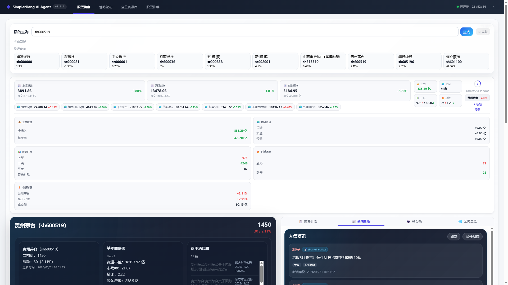
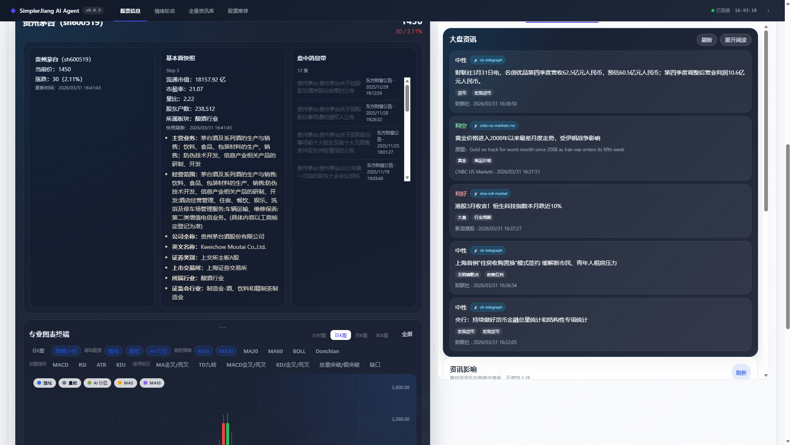
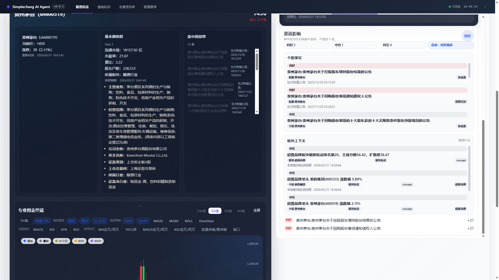
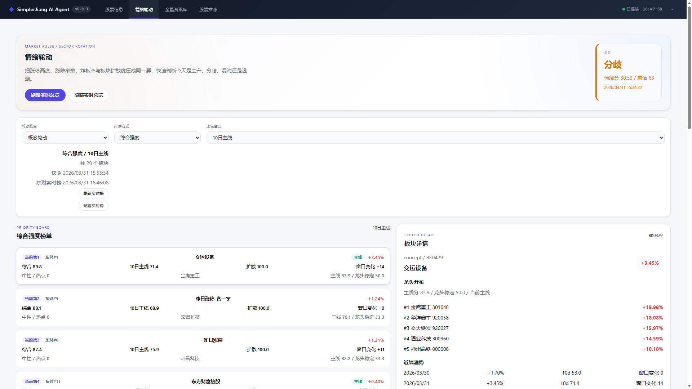
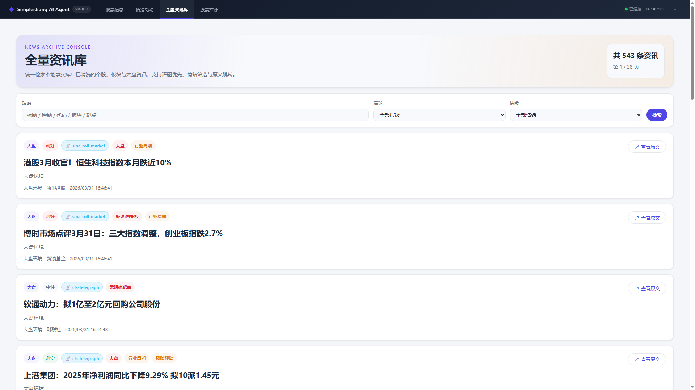
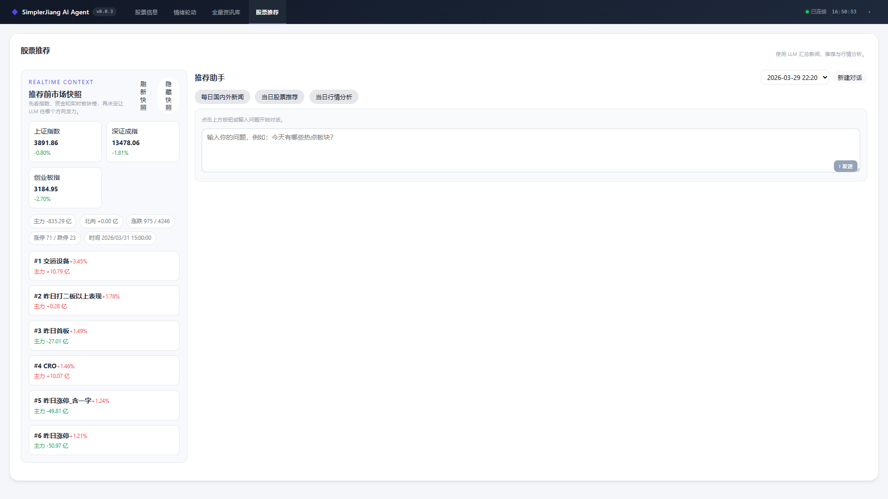

# StockCopilot

一个面向 **A 股研究、交易决策辅助与纪律执行** 的本地优先桌面工作台，也是一个已经落地运行的 **股票垂直多 Agent / 多 MCP 编排系统**。

它不是单一看盘软件，也不是只会聊天的 LLM 壳，更不是一个“套模型 API 的 Demo”。

`StockCopilot` 实际上把几类通常分散在不同工具中的能力，收束进了一套本地桌面系统里：

- **股票终端与个股工作区**
- **市场轮动与主线监控**
- **本地资讯归档与 AI 清洗**
- **多 Agent 股票推荐与辩论式研究**
- **交易计划、交易日志、复盘与纪律闭环**
- **本地模型、治理、审计、财报 Worker 运维**

如果用一句更准确的话描述它：

> **这是一套面向股票研究场景、带持久化状态机、MCP 工具调度、角色协作、交易闭环和本地运行能力的自研编排引擎 + 桌面工作台。**

当前项目的重点仍然是：

- **辅助决策，不直接自动下单**
- **把研究、执行、复盘串成闭环**
- **优先保证本地可运行、可追踪、可治理**

## 项目亮点

如果你只想先抓重点，`StockCopilot` 当前最值得看的就是这 4 件事：

### 1. 股票垂直的自研编排引擎

它不是把通用 Agent 框架硬套到股票场景里，而是直接围绕 **个股研究、市场轮动、风险讨论、交易计划、复盘闭环** 做了一套自研研究 pipeline。

### 2. 多 Agent + 多 MCP，不是“聊天 UI”

系统已经具备：

- 多角色协作分析
- 多阶段研究流程
- 多 MCP 工具调度与治理
- 研究结果持久化
- trace / 审计 / 失败回退

这意味着它更像一个 **研究操作系统**，而不是只会对话的壳子。

### 3. Local-first，不把核心能力绑死在云端

你可以在本地跑：

- 桌面工作台
- 后端 API
- 本地数据库
- 本地模型（Ollama）
- 财报采集 Worker

这对交易研究类软件非常重要，因为它直接关系到：

- 响应速度
- 成本可控
- 审计可追溯
- 运维复杂度

### 4. 不只研究，还把交易闭环做进去了

系统不是“研究完就结束”，而是把：

**市场信息 → AI 研究 → 推荐 / 决策 → 交易计划 → 交易日志 → AI 复盘**

串成了一条完整链路。

## 一眼看懂这套系统在做什么

你可以把 `StockCopilot` 理解成下面这条链：

1. **先收集市场、个股、板块、财报、新闻等信息**
2. **再让多个角色分别分析、互相辩论、逐步形成研究结论**
3. **然后沉淀成推荐、交易计划与风险约束**
4. **最后把执行结果与复盘结果回写到系统里**

也就是说，这不是一个单点能力产品，而是一套围绕股票研究与纪律执行构建的完整工作流。

## 架构图式文字说明

如果不看代码，只从系统分层来理解，`StockCopilot` 可以分成 4 层：

### 第 1 层：桌面工作台层

这是用户直接看到的部分，负责：

- 股票终端
- 市场轮动
- 全量资讯库
- 股票推荐
- 交易日志
- 财报页与后续财报中心

### 第 2 层：研究编排层

这是系统最有特色的一层，负责：

- 多 Agent 分工
- 多阶段 pipeline
- 并行分析与辩论
- 推荐与研究状态持久化
- Prompt 治理与结果压缩

这一层本质上就是你们的 **股票垂直编排引擎**。

### 第 3 层：MCP / 工具治理层

这一层负责把各种数据能力统一成可调度工具，包括：

- 公司概况
- 基本面
- 财报趋势
- 市场上下文
- 新闻与 Web 搜索
- 技术指标与策略结果

同时还负责：

- 权限控制
- 超时
- 重试
- trace
- 审计

### 第 4 层：Local-first 数据与运行时层

这一层负责：

- 本地数据库
- 本地模型接入
- 财报采集 Worker
- 桌面打包与本地启动
- 运行日志与治理能力

所以这套系统不是“前端 + API”而已，而是：

> **桌面工作台 + 股票研究编排引擎 + MCP 工具治理层 + Local-first 运行时**

## 交易闭环（Trading Loop）

这个项目最不一样的地方之一，是它不只停在“分析”，而是尽量把研究结果推进到后续动作和复盘：

1. **观察市场与个股**
2. **生成研究与推荐**
3. **形成交易计划**
4. **记录真实交易行为**
5. **回看盈亏、纪律、风险暴露**
6. **用 AI 做复盘与经验沉淀**

这就是它和很多“只给结论、不管执行”的 AI 工具最大的区别。

## v0.4.x 路线图（正在推进）

接下来的主线不只是继续堆功能，而是把财报与研究能力进一步产品化、白盒化、检索化。

### v0.4.0：财报中心基础落地

- 把 `财务数据测试` 升级为正式业务页面 `财报中心`
- 强化采集结果透明化：不再只显示数量，而是显示报告期、标题、来源、降级、补充摘要
- 把本地财报数据做成正式表格：分页、筛选、排序、详情入口

### v0.4.1：PDF 原件对照与手动重新解析

- 在软件内直接查看 PDF 原件
- 原件与解析结果并排对照
- 允许用户手动重新解析单份 PDF
- 在 `股票信息` 页与 `财报中心` 双入口统一呈现

### v0.4.2：财报 RAG Lite 与 .NET 技术路线定型

- 对财报叙述型文本做切块与本地检索
- 优先采用 Lite RAG，围绕现有系统做定制扩展
- 明确多 Agent 主编排层不整体重构，RAG 子系统保持可替换

### v0.4.3：Hybrid Retrieval 与 AI 集成增强

- 进一步尝试关键词 + 向量混合召回
- 把财报证据引用接入 AI 分析 / Recommend / Research 路径
- 预研更复杂的关系型 / 图谱型检索能力

## 项目定位

`StockCopilot` 不是“一个前端界面 + 一个后端接口”这么简单，它更接近一个完整的股票研究操作系统：

- 上层是桌面工作台
- 中层是多 Agent / 多 MCP 编排与业务状态机
- 下层是本地数据、资讯、财报、市场快照、交易记录与模型治理能力

它不是通用的 LangChain 克隆，但在股票场景里，它已经具备了一套**自研的研究编排能力**：

- 多角色协作
- 多阶段 pipeline
- 并行分析与辩论
- MCP 工具治理
- LLM 审计与 trace
- 研究结果持久化
- 交易计划与复盘回写

换句话说：

> **如果 LangChain / Agent Framework 解决的是“怎么把模型、工具和流程串起来”，那 `StockCopilot` 已经在股票场景里做出了一套更偏业务化、更偏本地优先、更偏交易闭环的自研版本。**

从工程结构上看，它是一个完整的多端协作工程，而不是单一脚本或 Demo：

- **Backend**：ASP.NET Core 8 Web API，负责数据同步、存储、配置与业务接口
- **Frontend**：Vue 3 + Vite 工作台界面，负责图表、资讯展示和交互体验
- **Desktop Shell**：.NET 8 WinForms + WebView2，将前后端封装为本地桌面应用
- **Local-first runtime**：支持本地 SQLite 运行，并保留切换数据库提供方的能力
- **Delivery pipeline**：支持 Windows 安装包、便携包、更新检测与发布链路

## 为什么这个项目不只是“又一个炒股软件”

很多股票软件擅长“看盘”，很多 AI Demo 擅长“问答”，但两者真正打通并且形成闭环的项目并不多。

`StockCopilot` 的独特点在于，它把以下几层同时做进来了：

1. **市场与个股信息层**
	- 指数、板块、个股、分时 / K 线、基本面、市场上下文、资讯影响

2. **研究编排层**
	- 多 Agent、多阶段 pipeline、角色分工、辩论、阶段快照、研究报告块生成

3. **工具治理层**
	- 多 MCP 工具统一调度、权限控制、超时、重试、trace、审计

4. **交易闭环层**
	- 交易计划、提醒、交易日志、风险敞口、胜率、复盘历史、AI 复盘

5. **本地运行与运维层**
	- 本地模型管理、请求级参数治理、财报 Worker、桌面安装包、打包交付

真正有价值的地方，不只是“能调用模型”，而是：

> **它已经在股票场景里把“信息 → 研究 → 讨论 → 决策 → 记录 → 复盘”串成了一条可运行链路。**

## 核心能力

- **股票终端与个股工作区**：支持 cache-first 详情加载、分时 / 日K / 月K / 年K、图表 chip 与全屏、基本面快照、市场上下文、新闻影响、财报页、交易计划起草 / 编辑 / 复核
- **情绪轮动与市场总览**：通过情绪轮动页查看市场阶段、主线板块、比较窗口、实时板块榜和市场快照，帮助判断主升、分歧或退潮
- **本地资讯库**：沉淀并检索个股、板块、市场多层级资讯，支持 AI 清洗状态展示和待处理批量清洗
- **多 Agent 股票推荐与研究协作**：内置多阶段研究 pipeline，覆盖市场扫描、板块分析、选股、辩论、决策等环节，支持 SSE 进度、会话历史、追问、traceId 与研究状态持久化
- **多 MCP 工具调度与治理**：不是简单“调几个接口”，而是统一调度公司概况、基本面、市场上下文、新闻、财报趋势、策略、Web 搜索等多类工具，并对超时、重试、权限和返回结果进行治理
- **交易计划 + 交易日志闭环**：支持计划草稿、总览、提醒、市场上下文、交易录入、持仓总览、胜率、做T 盈亏、AI 复盘与复盘历史
- **本地模型与治理能力**：支持 Ollama / 本地模型管理、请求级高级参数治理、LLM 审计日志、trace 查询和开发者治理模式
- **财报数据中心基础能力**：通过独立 Financial Worker 采集季度 / 年度财务数据，并在股票信息页内提供可刷新财务报表展示；后续路线图将继续演进为正式“财报中心 + PDF 对照解析 + 财报 RAG”
- **桌面交付**：安装后即可运行，不需要用户手动分别启动前后端与数据库

## 这套系统里“最硬核”的部分

如果只看 UI，它像一个桌面炒股工作台；但如果看内部结构，它更像一个股票垂直 AI 研究引擎。

当前仓库已经落地的“硬核部分”包括：

- **自研多阶段研究 pipeline**：从个股预检、分析师团队、研究辩论、交易提案、风险辩论到组合决策，完整持久化每个 turn / stage / role 的状态
- **角色执行器**：不是单次 LLM 调用，而是带 MCP 工具调度、结果压缩、Prompt 治理、超时与重试的角色执行层
- **MCP Gateway 治理层**：统一封装多类股票工具与 Web 工具，具备权限控制、访问日志与失败回退能力
- **研究结果资产化**：研究过程不是临时聊天记录，而是可以沉淀为阶段快照、决策快照、报告块、交易计划与复盘资产
- **Local-first 运行模型**：本地数据库、本地模型、本地桌面封装优先，减少对外部服务编排平台的强依赖

所以更准确的评价不是“这软件做得挺全”，而是：

> **它已经不是一个普通产品原型，而是一套面向股票研究场景、真正开始长出自研编排能力的产品引擎。**

## 技术栈

### Backend

- .NET 8
- ASP.NET Core Web API
- Entity Framework Core
- SQLite / SQL Server / MySQL（按配置切换）
- Swagger / OpenAPI

### Frontend

- Vue 3
- Vite
- ECharts
- KLineCharts
- Vitest / Playwright（前端测试与自动化能力）

### Desktop

- .NET 8 WinForms
- WebView2
- Windows 本地打包与安装分发

## 项目结构

```text
backend/   ASP.NET Core API、数据同步、业务模块、存储与配置
frontend/  Vue 3 工作台、图表与交互页面
desktop/   Windows 桌面壳，负责本地运行与嵌入前端
scripts/   打包、发布、自动化辅助脚本
docs/      截图与补充文档
```

## 截图

### 首页 · 市场总览 + 股票终端

主界面集成了市场总览（三大指数、全球指数、主力资金、涨跌广度、封板温度）和个股看盘终端，支持快速搜索和一键切换。



### 多源新闻聚合

右侧边栏实时展示来自 **财联社电报、新浪滚动、CNBC、Seeking Alpha、Investing.com** 等 15+ 数据源的市场资讯，带情绪标签和 AI 分析标注。



### 个股深度分析

支持个股事实（公告、板块上下文）和 AI 生成的资讯影响分析，利好/利空/中性分类清晰。



### 情绪轮动

把涨停强度、炸板率与板块扩散度压成同一屏，快速判断主升、分歧还是退潮，并可查看每个板块的龙头分布和近期趋势。



### 全量资讯库

统一检索本地事实库中已清洗的个股、板块与大盘资讯。支持评级筛选、情绪过滤与原文跳转，目前已累积 500+ 条资讯。



### 股票推荐 · 多 Agent 辩论系统

13 个 LLM Agent 协作完成从市场扫描到个股推荐的全流程分析。支持实时 SSE 进度推送、辩论过程可视化、团队进度面板、推荐报告卡片（含置信度、目标价、止损位）、历史会话管理与追问。



## 当前主分支状态

当前主分支的工作台已经包含 5 个主要业务页签：**股票信息、情绪轮动、全量资讯库、交易日志、股票推荐**。

此外，管理与运维能力通过设置下拉菜单进入，包括：

- **LLM 设置**
- **治理开发者模式**
- **财务数据测试**
- **财务工作者监控**

最近已落地主线包括：

- 股票信息页的 cache-first 详情链路、图表终端、基本面快照、市场上下文、财务报表和交易计划工作区
- 交易计划生命周期：草稿、总览、提醒、新闻复核、ActiveWatchlist 驱动的触发/复核链路
- 交易日志 / 纪律闭环基线：持仓总览、胜率、做T 盈亏、风险敞口、健康度、AI 复盘与复盘历史
- 股票推荐页的推荐前市场快照、SSE 进度、会话历史、追问与 traceId
- 治理开发者模式的 trace 查询与 LLM 审计日志查看
- 财务数据中心与独立 Financial Worker
- Ollama 本地模型启停、模型拉取、keepAlive 管理，以及 `num_ctx / keep_alive / num_predict / temperature / top_k / top_p / min_p / stop / think` 等请求级高级参数
- **v0.3.0**：修复本地模型完整 AI 分析卡住问题（NumPredict 256→2048、Research 场景 MaxOutputTokens=4096 + ResponseFormat=Json + 180s 超时保护）；修复前端轮询取消风暴；Research 实体 Unicode 支持 CJK；JSON 渲染容错
- **v0.3.1**：修复图表 hover tooltip 不显示的问题（适配 klinecharts v10 API），K 线蜡烛悬浮显示完整 OHLC + 涨跌幅 + 最高最低价；分时图悬浮显示价格 + 涨跌幅 + 量比
- **v0.3.2**：散户热度反向指标——基于东方财富/新浪/淘股吧三平台论坛帖量计算散户关注热度，K 线图子窗格展示热度曲线与信号标注；支持 60 个交易日历史回填与零填充；实时进度条显示回填状态
- **v0.3.3**：SocialSentimentMcp 增强——ForumPostCount/HeatRatio/HeatSignal/PlatformCount 四维特征输出至 LLM，交易提示模板添加散户情绪反向参考步骤
- **v0.3.4**：FinancialWorker 进程监控——主程序自动检测并管理 Worker 进程生命周期（心跳 10s、崩溃自动重启）；管理面板增加「工作者」标签，支持启动/停止/重启控制与运行时长显示；新增运行时日志控制台（内存环形缓冲区 + 增量轮询 + 级别筛选 + 自动滚动）
- **v0.3.5**：市场数据恢复与审计透明化——板块排行切换 bkzj 双键（f3+f62）；maxStreak 切换 THS 主路径（保留回退）；totalTurnover 切换至 eastmoney_market_fs_sh_sz（ulist secids 聚合）；成交额链路与广度链路解耦；`/api/market/audit` 扩展 reasons 与来源状态；前端补齐降级文案快照时间、BK 代码展示、龙头跳转、交易计划快照时间；smoke 5 源验证通过

### 市场数据恢复任务状态（2026-04-17）

- [x] 已完成：板块排行切到 bkzj 双键（f3+f62）
- [x] 已完成：maxStreak 切到 ths_continuous_limit_up（保留回退）
- [x] 已完成：totalTurnover 切到 eastmoney_market_fs_sh_sz（ulist secids 聚合）
- [x] 已完成：`/api/market/audit` 扩展 sources/bySource/recentSyncs/reasons
- [x] 已完成：前端降级文案与快照时间显示、BK代码展示、龙头跳转、交易计划弹窗快照时间
- [x] 已完成：smoke 脚本已补齐并能产生日志
- [ ] 待完成：盘中 3 轮全绿验收（4/21-4/23）

当前状态：代码与离线验收已就绪，待盘中最终放行。

当前最新发布版本为 **v0.3.5**（2026-04-17），详见 [GitHub Releases](https://github.com/simplerjiang/StockCopilot/releases)。

## 安装

推荐直接从 GitHub Releases 下载当前安装包或便携包：

- `SimplerJiangAiAgent-Setup-*.exe`
- `SimplerJiangAiAgent-portable-*.zip`

发布页：<https://github.com/simplerjiang/StockCopilot/releases>

## 本地运行说明

先选定本轮是在做源码验证还是打包桌面验证，不要在同一轮验证里混用。

源码验证：直接启动当前源码的 backend-served app，并以源码启动日志里的实际端口为准访问 `http://localhost:<port>`；不要假定 `5119`；不要使用 `.\start-all.bat`。

如果你希望验证打包后的桌面程序，可以在仓库根目录运行：

```powershell
.\start-all.bat
```

这个脚本会停止当前仓库残留进程，重新打包并启动桌面版程序，用于验证最终交付形态，而不是仅验证浏览器开发页。

打包桌面验证固定检查 `http://localhost:5119/api/health`，不要改成 `/health`。

如果需要从源码验证切到打包桌面验证，或反过来切换，先停掉旧模式留下的 repo-owned 进程，再按新模式重新读取当前端口。

如果重新打包失败且提示 `artifacts\windows-package` 下文件被占用，先结束该目录下旧的桌面或后端进程，再重跑 `scripts\publish-windows-package.ps1`。

## 配置说明

项目不强绑定单一 LLM 提供方。首次启动后，请根据自己的环境配置接口地址、模型名称和 API Key。

如果你想使用本地模型，也可以在 `LLM 设置` 页里直接管理 Ollama：查看状态、启动/停止、拉取模型、开启 keepAlive，并保存请求级高级参数（如 `num_ctx`、`keep_alive`、`num_predict`、`temperature`、`top_k`、`top_p`、`min_p`、`stop`、`think`）。

当前仓库已为 Ollama 请求级参数提供显式默认值：`num_ctx=2048`、`keep_alive=-1`、`num_predict=2048`、`temperature=0.3`、`top_k=64`、`top_p=0.95`、`min_p=0.0`、`stop=[]`、`think=false`。研究分析（Research）场景自动覆盖为 `num_predict=4096` 以确保结构化输出完整。

基于这台 RTX 5060 8GB 机器的本地压测，推荐优先使用：`gemma4:e2b`（5.1B / `Q4_K_M`）配合 `num_ctx=2048` 作为质量和响应速度的平衡点；如果你更看重纯速度而能接受更小模型，可选 `llama3.2:3b`（`Q4_K_M`）配合 `num_ctx=2048`。`gemma4:latest`（8B / `Q4_K_M`）在这台机器上明显更吃显存，除非你明确接受更高延迟，否则不建议作为默认本地模型。

## 相关文档

- 内部实现与目标台账：`README.llm.md`
- 面向回归执行的中文手册：`README.UserAgentTest.md`

## 下一阶段：竞品对标功能（规划中）

参考国内同类开源项目竞品分析，规划以下四项功能，按优先级顺序交付：

### P1：AI 回测验证（多窗口）

量化 AI 建议的历史准确率。系统已存储所有 commander 预测结果，将与实际日 K 线走势比对，按 1日/3日/5日/10日 四个窗口计算命中率，并在 K 线图上标注正确/错误标记。

### P2：策略问股扩展

在现有 9 种策略（RSI/KDJ/MACD 等）基础上增加**缠论**（笔/段/中枢/背驰）和**波浪理论**（推动浪/调整浪/黄金比例目标），并支持多策略收敛评分和策略教学模式。

### P3：筹码分布分析

基于日K量价数据本地计算换手率衰减筹码分布，可视化展示获利盘/套牢盘比例和平均成本，与 K 线日期联动，并将筹码摘要注入 Commander 分析上下文。

### P4：邮件推送 + 定时自动分析

每个交易日收盘后（15:35）自动分析自选股并将报告发送到指定邮箱。SMTP 配置和定时开关集成到现有设置页（同步将"LLM 设置"页改名为"设置"）。

详细设计见 [`docs/GOAL-NEW-FEATURES-competitive-plan.md`](docs/GOAL-NEW-FEATURES-competitive-plan.md)。

## 补充说明

完整开发记录、自动化说明和内部任务拆解仍保留在 `README.llm.md` 中；本 README 更侧重对外展示项目定位、架构和实际能力。