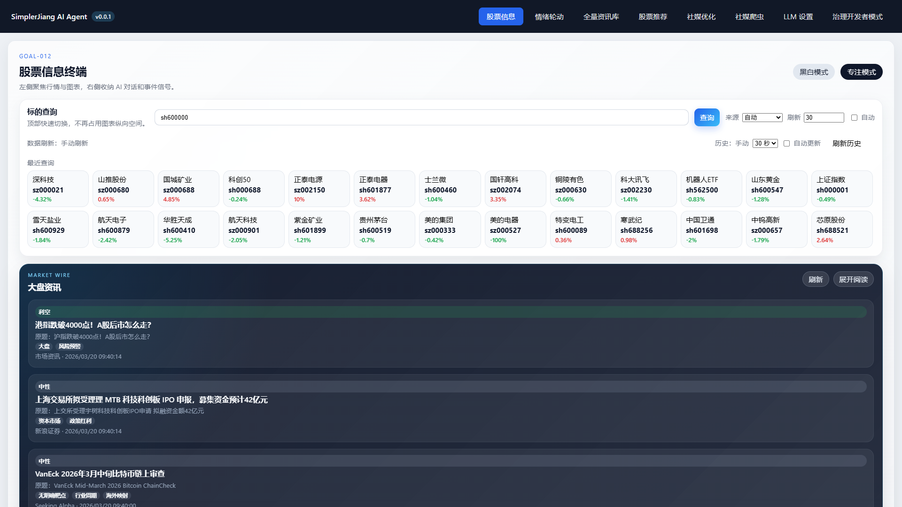
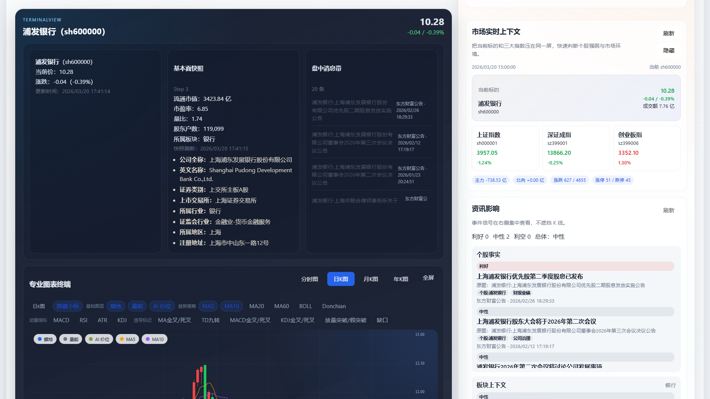
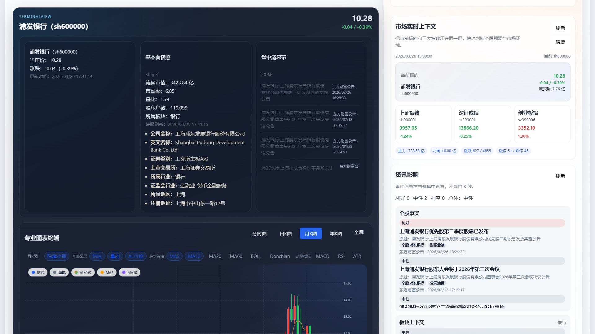
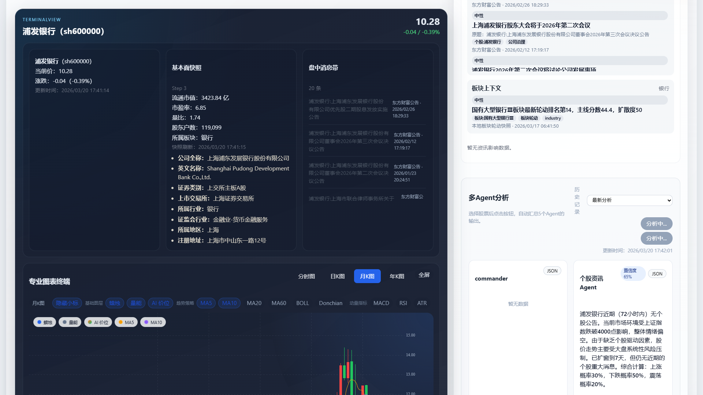
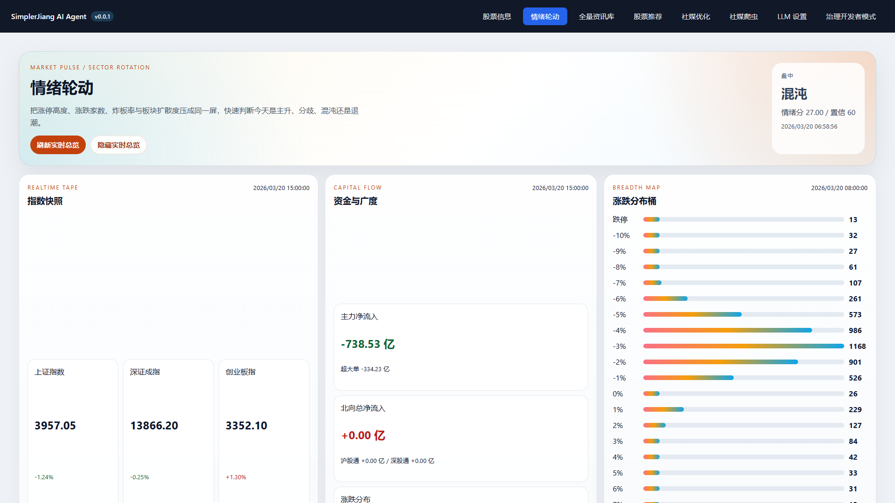
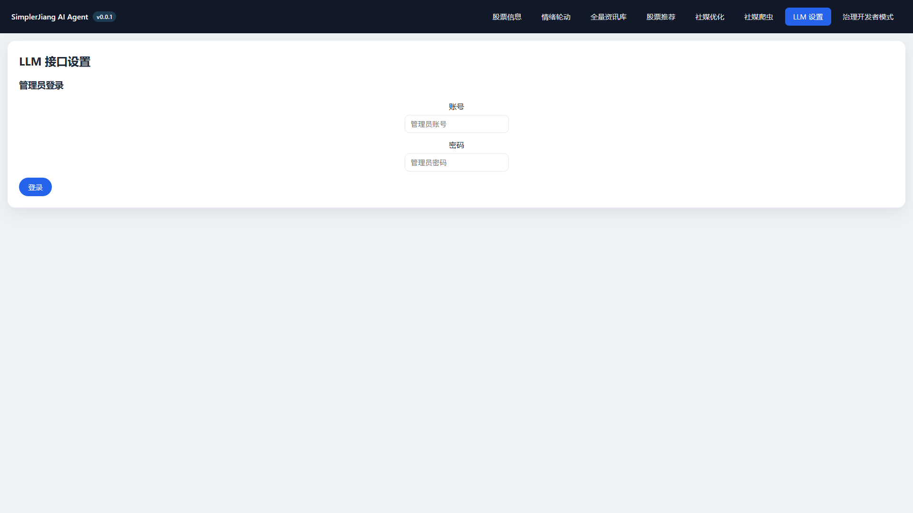

# Stock Copilot

一个更像“会看盘、会整理、会提醒”的本地股票助手。

它不是那种只会给你一堆指标和按钮的软件，也不是一句话瞎给结论的 AI 玩具。它的目标很直接：把看盘、看新闻、看板块、看图、看 AI 分析这几件事，收进一个能真正每天打开来用的桌面工具里。

一句话介绍：

> 这是一个面向 A 股场景的本地优先桌面助手，想做的是“让你少切窗口，少看噪音，更快抓到重点”。

完整的开发说明、技术细节、任务拆解和自动化记录，请直接看 `README.llm.md`。

## 它现在大概能干嘛

- 查股票，秒开终端视图，看分时、日 K、月 K、年 K
- 看多 Agent 分析结果，不只是一个结论，而是一整组判断、证据和风险提示
- 看市场情绪、板块轮动、实时资金和涨跌分布
- 看本地资讯库，把零散新闻整理成更适合人看的信息面
- 做交易计划草稿，后面还能接复核、观察和提醒
- 作为 Windows 桌面程序安装使用，不需要你自己折腾 SQL Server

说得直白一点，它想做的不是“替你炒股”，而是“把你每天本来就要做的那套流程，压缩得更顺手一点”。

## 截图

### 股票终端总览

打开就是主工作台，查标的、看价格、看消息、看快照，不需要在很多网页之间来回跳。

### 日 K 视图

不是只有一个静态图。这里能直接切到日 K，把图表放到更靠前的位置去看关键价位、形态和节奏。

### 月 K 视图

短线看分时，中线看日 K，拉长一点就看月 K。做波段的人，一眼就知道这个视图为什么重要。

### 多 Agent 分析

这部分是它现在最像“AI 助手”的地方。不是只吐一句看涨看跌，而是把核心判断、证据来源、触发条件、失效条件、风险上限都整理出来。

### 情绪轮动

如果你不想只盯一只票，这页更有用。它会把板块、市场阶段、资金强弱和整体温度拉到一个地方看。

### 首次启动和 LLM 设置

第一次打开如果还没配 LLM Key，会自动把你引到设置页，不需要自己研究配置文件藏在哪。

## 它适合谁

- 每天会反复切换“行情软件 + 新闻页 + 板块榜 + AI 对话框”的人
- 想把分析、看盘和计划收进一个桌面工具里的人
- 更喜欢本地数据、本地配置，而不是完全依赖在线 SaaS 的人
- 想要 AI 帮忙整理信息，但不想被 AI 一句“强烈建议买入”带跑偏的人

如果你想找的是一个“点一下就自动赚钱”的工具，那它不是。

如果你想找的是一个“把你原来那套交易准备流程做得更顺一点”的工具，那它就是往这个方向做的。

## 当前已实现

- Windows 桌面程序，可安装、可启动、可本地运行
- 打包版会自动拉起后端，不需要手工分别开前后端
- 本地 SQLite 数据底座已经打通，安装时不要求用户额外装数据库
- 股票终端支持分时图、日 K、月 K、年 K 和图表策略叠加
- 多 Agent 分析支持标准模式和 Pro 深度分析
- 情绪轮动页支持市场阶段、板块轮动、实时总览和实时板块榜
- 本地资讯库和新闻整理链路已经可用
- 首次启动会引导去配置 LLM Key
- 新版本会从 GitHub Releases 检查更新，并支持安装器升级

## 当前还没做完

- 更完整的自动更新与升级回滚体验
- 更成熟的交易计划提醒、执行和复盘闭环
- 更强的多 Agent 证据追溯和历史回放校准
- 更漂亮、更稳定、更接近正式产品的桌面交互细节

简化总结：

- 已经能用，而且已经不只是 Demo
- 还在继续打磨，尤其是交易闭环、更新体验和产品完成度

更多技术路线、完整任务清单和长期规划，请直接看 `README.llm.md`。

## 怎么安装

推荐直接从 GitHub Releases 下载安装版：

- `SimplerJiangAiAgent-Setup-<version>.exe`

发布页：<https://github.com/simplerjiang/AiAgent/releases>

如果你不想安装，也可以下载便携包：

- `SimplerJiangAiAgent-portable-<version>.zip`

## 第一次打开怎么用

1. 安装后启动程序。
2. 如果还没有配置可用的 LLM Key，程序会自动跳到 `LLM 设置`。
3. 用管理员账号登录。
4. 保存可用的 API Key。
5. 回到股票终端，开始查股票、看图和跑多 Agent 分析。

## 默认 LLM 接口说明

当前默认填写或示例使用的 LLM 接口地址是：

- https://one-api.bltcy.top/

这个地址来自第三方网站，不是本项目官方自建服务。

如果你准备继续使用这个接口，可以按你自己的需要去对应网站购买或配置可用额度，然后填写你自己的 API Key。

如果你不想使用这个第三方接口，也可以直接在 `LLM 设置` 里把接口地址改成你自己的服务，例如你自建的 One API、中转服务，或者其他兼容 OpenAI 接口格式的提供方。

项目本身不强绑定这个默认地址，真正决定是否可用的是你填写的接口地址、模型名称和 API Key 是否正确。

当前默认管理员账号：

- 用户名：`admin`
- 密码：`admin123`

## 自动更新

发布版桌面程序已经接上 GitHub Releases 更新检测：

- 启动后会检查有没有新版本
- 有新版本时会弹窗提醒
- 确认后会自动下载安装器并执行升级

本地数据、日志和 LLM 配置仍然保存在当前 Windows 用户目录，不会因为升级就被覆盖掉。

## 数据放在哪

打包版默认会把运行数据放到：

- `%LOCALAPPDATA%\SimplerJiangAiAgent`

这样做的好处很简单：

- 数据和日志跟程序本体分开，升级时更稳
- 换版本时不容易把你的本地配置和使用痕迹一起覆盖掉

想看完整技术方案、自动化任务和开发路线，直接去 `README.llm.md`。
