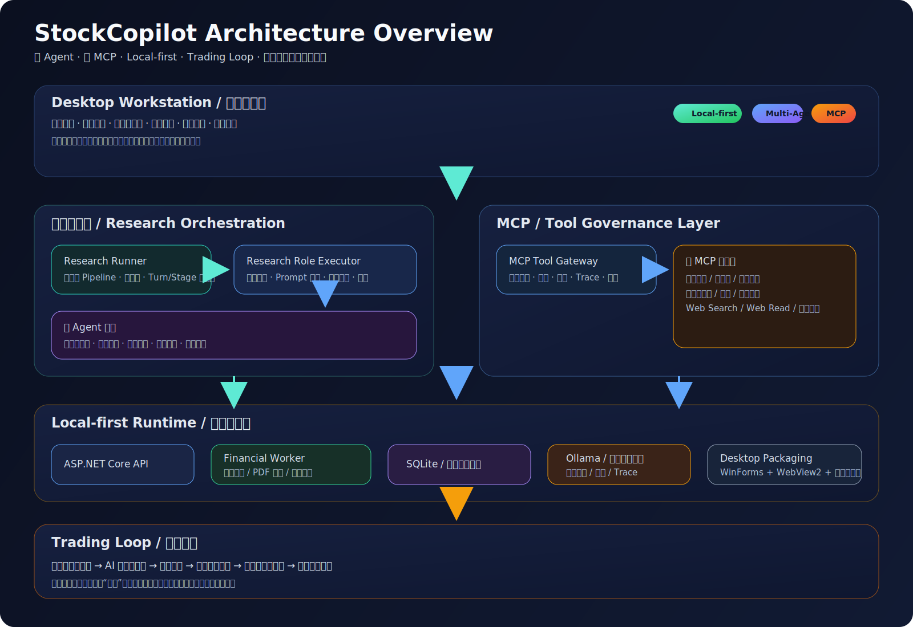

# StockCopilot

[](./desktop)
[](./backend)
[](./frontend)
[](#本地运行说明)
[](#这套系统里最硬核的部分)
[](#交易闭环trading-loop)

一个给 **A 股研究、交易决策辅助和纪律执行** 用的本地优先桌面工作台。

这个项目最开始并不是想做一个“很宏大”的平台，而是想把日常真的会反复切来切去的几件事放到一个地方：看盘、看资讯、做研究、写计划、记交易、做复盘。

后来越做越深，它慢慢长成了一套带 **多 Agent、多个 MCP 工具入口、研究状态机、财报 Worker 和交易闭环** 的系统。

如果一定要用一句话概括它：

> **它更像一套把研究、计划、执行和复盘连起来的股票研究工作台，里面已经长出了自己的多 Agent / 多 MCP 编排能力。**

当前项目的重点仍然是：

- **辅助决策，不直接自动下单**
- **把研究、执行、复盘串成闭环**
- **优先保证本地可运行、可追踪、可治理**

## 🔥 特色介绍

`StockCopilot` 现在比较有意思的地方，不是“功能很多”，而是下面这几条原本分散的链路，已经真的开始接起来了：

- **把股票研究做成多阶段、多角色、可回放的流程**
- **把 MCP 工具调用做成有治理、有超时、有重试、有 trace 的系统能力**
- **把本地模型能力真正接入业务，而不是停留在玩具对话层**
- **把交易计划、执行记录和 AI 复盘连成闭环**

如果只看最核心的特点，现在可以先记住这 4 点：

### 1. 股票垂直的自研编排能力

它不是把通用 Agent 框架直接套一层股票皮，而是围绕 **个股研究、市场轮动、风险讨论、交易计划、复盘闭环** 一点点长出来的一套研究 pipeline。

### 2. 多 Agent + 多 MCP，不只是聊天界面

系统已经具备：

- 多角色协作分析
- 多阶段研究流程
- 多 MCP 工具调度与治理
- 研究结果持久化
- trace / 审计 / 失败回退

这意味着它更像一个真正能跑研究流程的系统，而不只是一个会说话的壳子。

### 3. Local-first，不把核心能力绑死在云端

你可以在本地跑：

- 桌面工作台
- 后端 API
- 本地数据库
- 本地模型（Ollama）
- 财报采集 Worker

这对交易研究类软件非常重要，因为它直接关系到：

- 响应速度
- 成本可控
- 审计可追溯
- 运维复杂度

### 4. 不只研究，还把交易闭环做进去了

系统不是“研究完就结束”，而是把：

**市场信息 → AI 研究 → 推荐 / 决策 → 交易计划 → 交易日志 → AI 复盘**

串成了一条完整链路。

## 📋 核心功能

现在 `StockCopilot` 已经把几类原本分散在不同工具中的能力收进了一套本地桌面系统里：

- **股票终端与个股工作区**：支持 cache-first 详情加载、分时 / 日K / 月K / 年K、图表 chip 与全屏、基本面快照、市场上下文、新闻影响、财报页、交易计划起草 / 编辑 / 复核
- **情绪轮动与市场总览**：通过情绪轮动页查看市场阶段、主线板块、比较窗口、实时板块榜和市场快照，帮助判断主升、分歧或退潮
- **本地资讯库**：沉淀并检索个股、板块、市场多层级资讯，支持 AI 清洗状态展示和待处理批量清洗
- **多 Agent 股票推荐与研究协作**：内置多阶段研究 pipeline，覆盖市场扫描、板块分析、选股、辩论、决策等环节，支持 SSE 进度、会话历史、追问、traceId 与研究状态持久化
- **多 MCP 工具调度与治理**：不是简单“调几个接口”，而是统一调度公司概况、基本面、市场上下文、新闻、财报趋势、策略、Web 搜索等多类工具，并对超时、重试、权限和返回结果进行治理
- **交易计划 + 交易日志闭环**：支持计划草稿、总览、提醒、市场上下文、交易录入、持仓总览、胜率、做T 盈亏、AI 复盘与复盘历史
- **本地模型与治理能力**：支持 Ollama / 本地模型管理、请求级高级参数治理、LLM 审计日志、trace 查询和开发者治理模式
- **财报中心与 RAG 检索**：独立 Financial Worker 采集财务数据，财报中心支持分页筛选与详情查看；PDF 原件可在软件内直接浏览和对照解析；财报文本经 jieba 分词 + Embedding 混合检索入库 RAG，AI 分析时自动引用财报证据
- **桌面交付**：安装后即可运行，不需要用户手动分别启动前后端与数据库

## 🖼️ 软件截图

### 首页 · 市场总览 + 股票终端

主界面集成了市场总览（三大指数、全球指数、主力资金、涨跌广度、封板温度）和个股看盘终端，支持快速搜索和一键切换。


### 多源新闻聚合

右侧边栏实时展示来自 **财联社电报、新浪滚动、CNBC、Seeking Alpha、Investing.com** 等 15+ 数据源的市场资讯，带情绪标签和 AI 分析标注。


### 个股深度分析

支持个股事实（公告、板块上下文）和 AI 生成的资讯影响分析，利好/利空/中性分类清晰。


### 情绪轮动

把涨停强度、炸板率与板块扩散度压成同一屏，快速判断主升、分歧还是退潮，并可查看每个板块的龙头分布和近期趋势。


### 全量资讯库

统一检索本地事实库中已清洗的个股、板块与大盘资讯。支持评级筛选、情绪过滤与原文跳转，目前已累积 500+ 条资讯。


### 股票推荐 · 多 Agent 辩论系统

13 个 LLM Agent 协作完成从市场扫描到个股推荐的全流程分析。支持实时 SSE 进度推送、辩论过程可视化、团队进度面板、推荐报告卡片（含置信度、目标价、止损位）、历史会话管理与追问。


## 🧭 架构总览

如果用最直观的方式理解，这套系统大致可以看成 4 层：

1. **桌面工作台层**：股票终端、市场轮动、资讯库、股票推荐、交易日志、财报页
2. **研究编排层**：多 Agent 分工、多阶段 pipeline、并行分析与辩论、状态持久化
3. **MCP / 工具治理层**：公司概况、基本面、财报趋势、新闻、Web 搜索、技术指标等统一工具入口
4. **Local-first 运行时层**：本地数据库、本地模型、财报 Worker、桌面打包与运行日志

下面这张图画的是当前最核心的系统分层：



## 📦 Release 下载

当前最新发布版本为 **v0.4.6**（2026-04-24），详见 GitHub Releases：

<https://github.com/simplerjiang/StockCopilot/releases>

推荐直接下载：

- `SimplerJiangAiAgent-Setup-*.exe`
- `SimplerJiangAiAgent-portable-*.zip`

## 🚀 下一步计划（v0.4.7+）

v0.4.0 到 v0.4.6 原本的目标——让财报数据真正变成系统的一等公民，从采集、解析、检索到 AI 引用一路打通——已经落地了。接下来的重点是两件事：

### AI 分析质量打磨

现在 AI 分析页面偶尔还会把 LLM 返回的原始 JSON 直接渲染出来。这种情况通常出现在 LLM 输出里嵌套了 JSON 代码块时，前端没能正确识别和转义。v0.4.7 会把这条路径彻底堵住，保证用户看到的始终是可读的结构化分析，而不是一坨 JSON。

### 个股公告 PDF 自动入库

目前盘中消息带里的"东方财富网公告"实际上包含大量个股公告 PDF，但系统只是把链接原样传给 LLM——LLM 大概率并没有真正读过这些文件。v0.4.7 会把这些公告 PDF 自动爬取下来、切块 embedding、入库 RAG，让 LLM 在做研究分析时能真正引用公告内容，而不是对着一个链接空谈。

## ✅ 已实现的主要能力

### 当前工作台结构

当前主分支的工作台已经包含 5 个主要业务页签：**股票信息、情绪轮动、全量资讯库、交易日志、股票推荐**。

此外，管理与运维能力通过设置下拉菜单进入，包括：

- **LLM 设置**
- **治理开发者模式**
- **财务数据测试**
- **财务工作者监控**

### 近期已落地主线

- 股票信息页的 cache-first 详情链路、图表终端、基本面快照、市场上下文、财务报表和交易计划工作区
- 交易计划生命周期：草稿、总览、提醒、新闻复核、ActiveWatchlist 驱动的触发/复核链路
- 交易日志 / 纪律闭环基线：持仓总览、胜率、做T 盈亏、风险敞口、健康度、AI 复盘与复盘历史
- 股票推荐页的推荐前市场快照、SSE 进度、会话历史、追问与 traceId
- 治理开发者模式的 trace 查询与 LLM 审计日志查看
- 财务数据中心与独立 Financial Worker
- Ollama 本地模型启停、模型拉取、keepAlive 管理，以及 `num_ctx / keep_alive / num_predict / temperature / top_k / top_p / min_p / stop / think` 等请求级高级参数

### 近期版本进展

- **v0.3.0**：修复本地模型完整 AI 分析卡住问题（NumPredict 256→2048、Research 场景 MaxOutputTokens=4096 + ResponseFormat=Json + 180s 超时保护）；修复前端轮询取消风暴；Research 实体 Unicode 支持 CJK；JSON 渲染容错
- **v0.3.1**：修复图表 hover tooltip 不显示的问题（适配 klinecharts v10 API），K 线蜡烛悬浮显示完整 OHLC + 涨跌幅 + 最高最低价；分时图悬浮显示价格 + 涨跌幅 + 量比
- **v0.3.2**：散户热度反向指标——基于东方财富/新浪/淘股吧三平台论坛帖量计算散户关注热度，K 线图子窗格展示热度曲线与信号标注；支持 60 个交易日历史回填与零填充；实时进度条显示回填状态
- **v0.3.3**：SocialSentimentMcp 增强——ForumPostCount/HeatRatio/HeatSignal/PlatformCount 四维特征输出至 LLM，交易提示模板添加散户情绪反向参考步骤
- **v0.3.4**：FinancialWorker 进程监控——主程序自动检测并管理 Worker 进程生命周期（心跳 10s、崩溃自动重启）；管理面板增加「工作者」标签，支持启动/停止/重启控制与运行时长显示；新增运行时日志控制台（内存环形缓冲区 + 增量轮询 + 级别筛选 + 自动滚动）
- **v0.3.5**：市场数据恢复与审计透明化——板块排行切换 bkzj 双键（f3+f62）；maxStreak 切换 THS 主路径（保留回退）；totalTurnover 切换至 eastmoney_market_fs_sh_sz（ulist secids 聚合）；成交额链路与广度链路解耦；`/api/market/audit` 扩展 reasons 与来源状态；前端补齐降级文案快照时间、BK 代码展示、龙头跳转、交易计划快照时间；smoke 5 源验证通过
- **v0.4.0**：财报中心正式落地——从原来的隐藏测试页升级为正式业务页面，支持分页、筛选、排序和详情查看；采集结果不再只显示一个数字，而是把报告期、标题、来源、降级状态全部透明化
- **v0.4.1**：PDF 原件可以直接在软件里看了——不用再去网页打开下载，支持解析结果与原件并排对照、手动重新解析、5 阶段 pipeline 可视化追踪
- **v0.4.2**：财报 RAG 基线上线——对财报叙述型文本做 jieba 分词 + 三层切块 + SQLite FTS5 全文检索 + BM25 排序，同时修了一批遗留 BLOCKER（smartPickPdfId 错选、X-Frame-Options 阻止 PDF 显示、publish 打包脚本等）
- **v0.4.3**：Hybrid Retrieval + AI 集成——在 BM25 基础上加入 Embedding 向量检索混合召回，Citation DTO 和引用芯片组件让 AI 回答能标注出证据来源；新增 Embedding Model 管理界面
- **v0.4.4**：一轮产品质量修复——推荐状态 zombie 清理、情绪轮动恢复、基本面字段补全（浮动市值 / 市盈率 / 量比）、SQLite 并发写入防崩，跑完 1160 个测试全绿
- **v0.4.5**：数据质量与 Worker 稳定性——THS 数值单位从万元归一化到元、Worker 崩溃自动重启加速、cninfo 加浏览器 headers 解决 PDF 下载被拒、采集面板内嵌到财报中心
- **v0.4.6**：多 Agent 路由与财报 RAG 闭环——问题意图分类器自动路由到正确取证链路，Research / Recommend / LiveGate 子角色全部接上了 RAG，回答必须带可验证证据；User Rep B+ 验收通过；另外补了散户热度图表改进、论坛爬虫重试、cninfo 搜索修复

## 🛠️ 安装与配置

### 安装

推荐直接从 GitHub Releases 下载当前安装包或便携包：

- `SimplerJiangAiAgent-Setup-*.exe`
- `SimplerJiangAiAgent-portable-*.zip`

### 本地运行说明

先选定本轮是在做源码验证还是打包桌面验证，不要在同一轮验证里混用。

源码验证：直接启动当前源码的 backend-served app，并以源码启动日志里的实际端口为准访问 `http://localhost:<port>`；不要假定 `5119`；不要使用 `.\start-all.bat`。

如果你希望验证打包后的桌面程序，可以在仓库根目录运行：

```powershell
.\start-all.bat
```

这个脚本会停止当前仓库残留进程，重新打包并启动桌面版程序，用于验证最终交付形态，而不是仅验证浏览器开发页。

打包桌面验证固定检查 `http://localhost:5119/api/health`，不要改成 `/health`。

如果需要从源码验证切到打包桌面验证，或反过来切换，先停掉旧模式留下的 repo-owned 进程，再按新模式重新读取当前端口。

如果重新打包失败且提示 `artifacts/windows-package` 下文件被占用，先结束该目录下旧的桌面或后端进程，再重跑 `scripts/publish-windows-package.ps1`。

### 配置说明

项目不强绑定单一 LLM 提供方。首次启动后，请根据自己的环境配置接口地址、模型名称和 API Key。

如果你想使用本地模型，也可以在 `LLM 设置` 页里直接管理 Ollama：查看状态、启动/停止、拉取模型、开启 keepAlive，并保存请求级高级参数（如 `num_ctx`、`keep_alive`、`num_predict`、`temperature`、`top_k`、`top_p`、`min_p`、`stop`、`think`）。

当前仓库已为 Ollama 请求级参数提供显式默认值：`num_ctx=2048`、`keep_alive=5m`、`num_predict=256`、`temperature=0.3`、`top_k=64`、`top_p=0.95`、`min_p=0.0`、`stop=[]`、`think=false`。`keep_alive=0` 表示请求结束后立即卸载模型；不再推荐使用 `-1` 常驻。研究分析（Research）场景自动覆盖为 `num_predict=4096` 以确保结构化输出完整。

基于这台 RTX 5060 8GB 机器的本地压测，推荐优先使用：`gemma4:e2b`（5.1B / `Q4_K_M`）配合 `num_ctx=2048` 作为质量和响应速度的平衡点；如果你更看重纯速度而能接受更小模型，可选 `llama3.2:3b`（`Q4_K_M`）配合 `num_ctx=2048`。`gemma4:latest`（8B / `Q4_K_M`）在这台机器上明显更吃显存，除非你明确接受更高延迟，否则不建议作为默认本地模型。

## 📚 相关文档

- 内部实现与目标台账：`README.llm.md`
- 面向回归执行的中文手册：`README.UserAgentTest.md`
- 竞品功能规划：`docs/GOAL-NEW-FEATURES-competitive-plan.md`

## 补充说明

完整开发记录、自动化说明和内部任务拆解仍保留在 `README.llm.md` 中；本 README 更侧重对外展示项目定位、架构和实际能力。