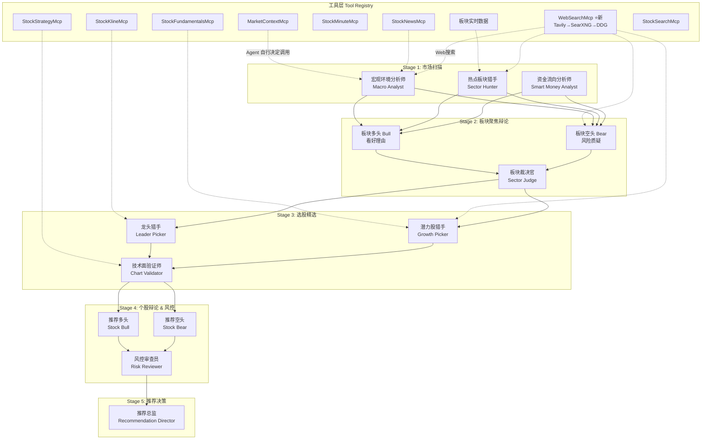
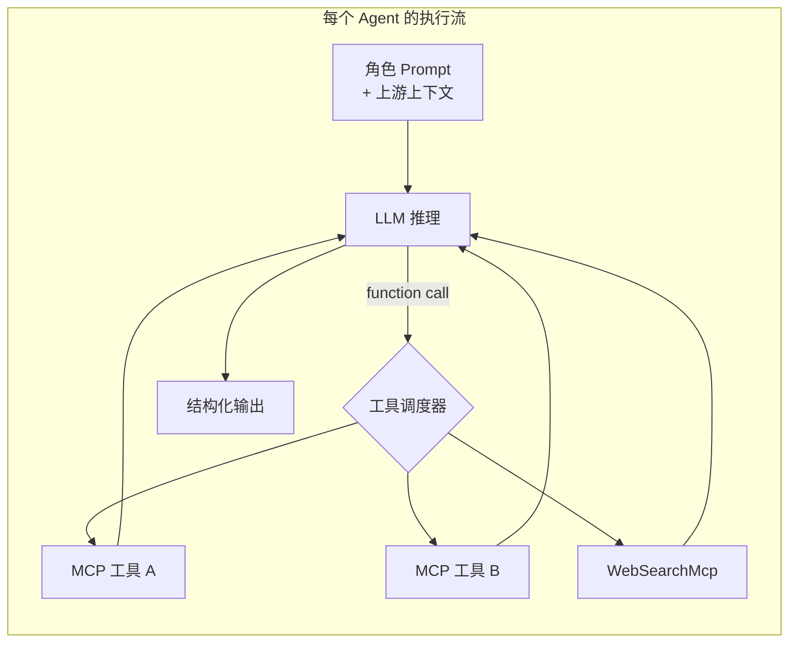
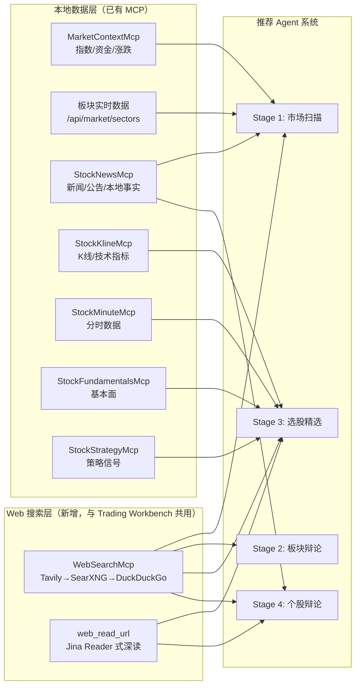
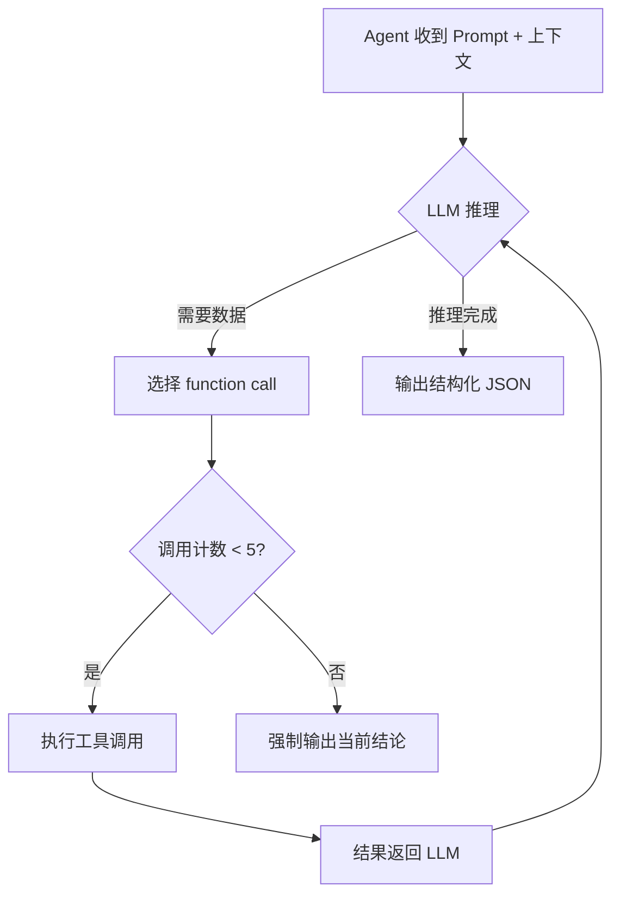
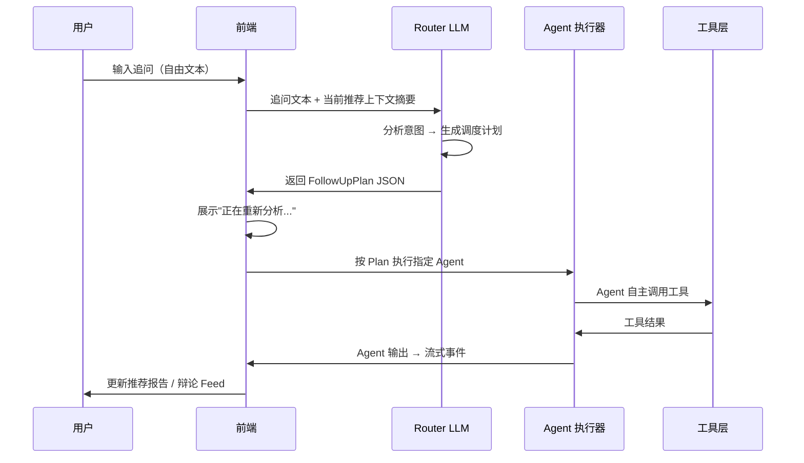
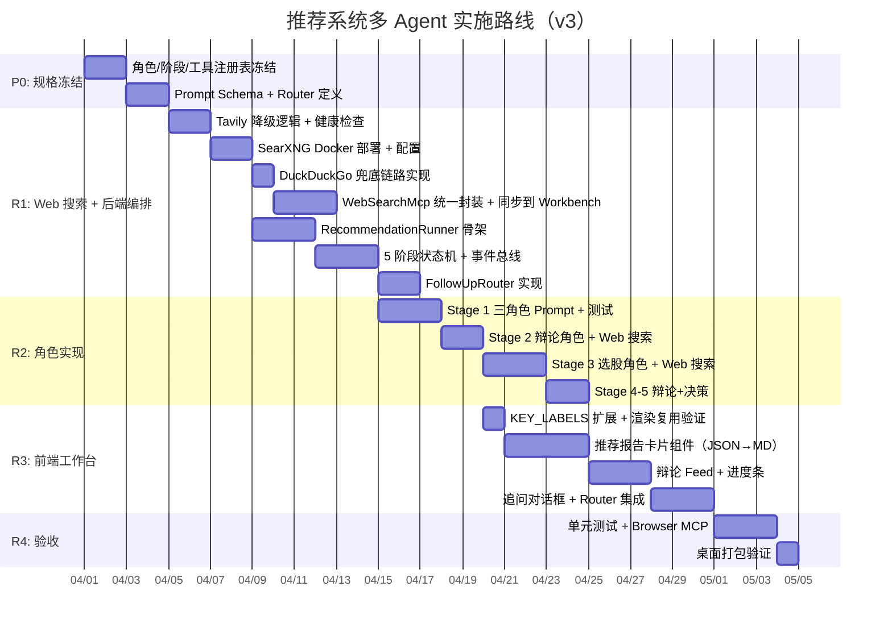

# GOAL-RECOMMEND: 推荐助手多 Agent 辩论系统设计计划书

> **版本**: v3.0  
> **日期**: 2026-03-31  
> **状态**: 规划中  
> **参考**: GOAL-AGENT-NEW-001 Trading Workbench · TradingAgents-AShare · prompts.chat

---

## 一、设计目标

将当前**推荐助手**（单 LLM 问答）升级为**多 Agent 协作推荐系统**：

1. **板块发现** → **选股精选** → **走势验证** → **风险辩论** → **推荐决策**
2. 给 LLM 更多自主推荐空间，不限于用户指定标的
3. 全程结构化、可回溯、可追问
4. **Agent 自主决策调用工具**——每个 Agent 自行决定调用哪些 MCP / Web 搜索，不做硬编码权限矩阵
5. **追问由 LLM Router 驱动**——用户追问后由路由 LLM 判断该召唤哪些 Agent 重新辩论

与 Trading Workbench（GOAL-AGENT-NEW-001）的核心区别：

| 维度 | Trading Workbench | 推荐系统 |
|------|-------------------|----------|
| 输入 | 用户指定一只股票 | LLM 自主发现板块和个股 |
| 目的 | 深度分析已知标的 | 广撒网筛选值得关注的机会 |
| 输出 | 单票研究报告 + 交易提案 | 板块推荐 + 多票精选 + 理由 |
| 焦点 | 严谨治理和风控 | 发现性和时效性 |
| 信息源 | 本地 MCP 为主 | **Web 搜索 + 本地 MCP 混合** |
| 工具调度 | 按阶段固定权限 | **Agent 自主选择工具** |
| 追问 | 固定路由表 | **LLM Router 动态派遣** |
| 输出渲染 | JSON→Markdown（前端 JS） | **复用同一套 jsonMarkdownService** |

---

## 二、Web 搜索工具层

> 当前新闻 MCP 存库内容有限，推荐系统需要 **实时网络信息** 来增强发现能力。

### 2.1 开源 / 免费 Web 搜索方案对比

| 方案 | 类型 | 费用 | 特点 | 推荐度 |
|------|------|------|------|--------|
| **SearXNG** | 自建元搜索引擎 | **完全免费** | 聚合 250+ 搜索引擎（Google/Bing/Baidu 等），自部署 Docker 容器，隐私友好，JSON API 开箱即用 | ⭐⭐⭐⭐⭐ |
| **DuckDuckGo Search** | Python 库 | **完全免费** | MIT 开源（`pip install ddgs`），支持 text/news/images 搜索，有 `timelimit` 参数过滤新近结果 | ⭐⭐⭐⭐ |
| **Brave Search API** | 云端 API | **免费 2000 次/月** | 独立索引（非 Google 代理），有 news 专用端点，超额 $5/1k 查询 | ⭐⭐⭐ |
| **Serper.dev** | Google SERP API | 2500 次免费试用 | Google 实时结果，快速（1-2秒），后付费 $1/1k 查询 | ⭐⭐⭐ |
| **Tavily** | AI 搜索 API | 付费（已集成） | 结果质量高，自动摘要提取，LangChain/CrewAI 原生支持，**项目已实现** | ⭐⭐⭐⭐⭐ |
| **Jina Reader** | URL→文本 | **开源免费** | 将任意 URL 转为 LLM 友好的 Markdown 文本，适合搜索后的深度阅读 | 辅助工具 |

### 2.2 推荐方案：Tavily（主）→ SearXNG（一级降级）→ DuckDuckGo（二级降级）

> **v3 核心变更**：项目已集成 Tavily，优先复用现有能力；SearXNG 和 DuckDuckGo 作为降级链路保障可用性。**三条链路必须都实现并通过健康检查**，且同步到 Trading Workbench（GOAL-AGENT-NEW-001）。

```
┌──────────────────────────────────────────────────────────┐
│              WebSearchMcp（推荐系统 + Trading Workbench）   │
│                                                          │
│  ┌──────────────────────────────┐                        │
│  │ ① Tavily（主链路）            │  ← 已实现，结果质量最高 │
│  │   AI 搜索 + 自动摘要提取      │    LangChain/CrewAI 原生│
│  └──────────────────────────────┘                        │
│       │ 请求失败 / 额度耗尽 / 超时                        │
│       ▼ 自动降级                                         │
│  ┌──────────────────────────────┐                        │
│  │ ② SearXNG（一级降级）         │  ← 自建 Docker 容器    │
│  │   聚合 250+ 引擎，完全免费     │    无额度限制          │
│  └──────────────────────────────┘                        │
│       │ 容器不可达 / 引擎全部限流                         │
│       ▼ 自动降级                                         │
│  ┌──────────────────────────────┐                        │
│  │ ③ DuckDuckGo (ddgs)（二级降级）│  ← 零部署，直接调用    │
│  │   MIT 开源，news() 天然适配    │    无 API Key 依赖     │
│  └──────────────────────────────┘                        │
│                                                          │
│  降级策略:                                                │
│  · Tavily: HTTP 4xx/5xx 或 quota_exceeded → 降级         │
│  · SearXNG: 连接超时 (3s) 或返回 0 结果 → 降级            │
│  · DuckDuckGo: 最终兜底，失败则返回空 + 告警               │
│  · 降级事件写入 ResearchEventBus，前端实时显示当前链路状态   │
└──────────────────────────────────────────────────────────┘
```

**Tavily 主链路理由**：
1. **已实现** ——项目中已有 Tavily 集成代码，零新增工作量
2. **结果质量最高** ——AI 预处理搜索结果，自动提取摘要，减少 LLM token 消耗
3. **LangChain / CrewAI 原生支持** ——与 Agent 框架天然兼容
4. 额度用尽时自动降级到免费链路，无服务中断

**SearXNG 一级降级理由**：
1. **完全免费**，无 API 调用限额
2. 聚合 Google / Bing / Baidu / Yahoo 等主流引擎，一次搜索多源结果
3. 部署简单：`docker run -p 8080:8080 searxng/searxng`
4. 自带 JSON API：`GET /search?q=半导体+政策&format=json&time_range=week`
5. 可配置引擎白名单，针对中文支持启用 Baidu/Sogou/Bing

**DuckDuckGo 二级降级理由**：
1. 零部署——C# 后端通过 HTTP 调用或委托 Python 脚本
2. `news()` 接口天然适合新闻搜索
3. 有 `timelimit` 参数：`d`（天）/`w`（周）/`m`（月）
4. 作为最终兜底，确保即使 Tavily 额度耗尽且 SearXNG 容器不可用，系统仍能搜索

### 2.3 降级链路健康检查

三条链路必须在系统启动时通过健康检查，运行时持续监控：

```csharp
public class WebSearchHealthCheck : IHealthCheck
{
    // 启动时：三条链路各执行一次 probe 查询
    // 运行时：每 5 分钟执行一次探活
    // 状态：Healthy / Degraded / Unhealthy
    //
    // Tavily:     GET https://api.tavily.com/health  (或试探查询)
    // SearXNG:    GET http://localhost:8080/search?q=test&format=json
    // DuckDuckGo: DDGS().text("test", max_results=1)
}
```

### 2.4 同步到 Trading Workbench

> WebSearchMcp 为**共享基础设施**，推荐系统与 Trading Workbench 使用同一个实现和降级链路。

| 维度 | 实现方式 |
|------|----------|
| 代码位置 | `Infrastructure/Mcp/WebSearchMcp.cs`（共用） |
| 降级配置 | `appsettings.json` → `WebSearch:PrimaryProvider` / `FallbackOrder` |
| Tavily Key | 环境变量 `TAVILY_API_KEY`（不入库） |
| Trading Workbench 接入 | 在 `RoleToolPolicyService` 注册 `web_search` / `web_search_news` / `web_read_url` |
| 健康状态 | 通过 `/api/health/websearch` 暴露，前端可查 |

### 2.5 WebSearchMcp 接口设计

```csharp
// 新建 MCP：WebSearchMcp
public class WebSearchMcp : IMcpToolProvider
{
    // 搜索类型
    enum SearchType { Web, News, Finance }
    
    // 核心工具
    Tool[] GetTools() => [
        new("web_search",       "搜索互联网获取实时信息"),
        new("web_search_news",  "搜索最近的新闻报道"),
        new("web_read_url",     "读取指定 URL 的完整内容"),
    ];
}
```

```typescript
// Agent 调用示例（在 Prompt 中以 function calling 形式暴露）
web_search({ query: "半导体 国产替代 政策 2026", time_range: "week", max_results: 10 })
web_search_news({ query: "新能源车 销量", time_range: "day", max_results: 5 })
web_read_url({ url: "https://finance.eastmoney.com/...", extract_mode: "article" })
```

---

## 三、系统架构

### 3.1 多 Agent 流水线（5 阶段）+ 自主工具调度



### 3.2 Agent 自主工具调度模型

> **核心变化**：不再为每个 Stage 硬编码 MCP 权限表。每个 Agent 拥有完整的工具注册表，通过 Prompt 中的角色设定和 function calling 机制，**由 LLM 自行判断需要调用哪些工具**。



**调度策略**：

| 策略 | 说明 |
|------|------|
| 工具全量注册 | 每个 Agent 可见所有工具的 `name + description`，由 LLM 按需选用 |
| Prompt 引导 | 通过角色 Prompt 引导偏好（如"宏观分析师优先搜索宏观政策新闻"），但不强制 |
| 调用预算 | 每个 Agent 最多调用 **5 次** 工具（防止死循环），超限后强制输出 |
| 工具优先级建议 | Prompt 中标注建议优先级（如"优先使用 web_search 获取实时信息，MarketContextMcp 获取本地数据"），Agent 可忽略 |
| 结果缓存 | 同一会话内相同查询自动命中缓存，减少重复调用 |

### 3.3 与现有系统的数据流



---

## 四、Agent 角色设计

> 参考 TradingAgents-AShare 的 14 Agent 架构，针对"推荐"场景重新设计为 **11 个角色 + 1 个追问路由器**。  
> 每个 Agent **自行决定调用哪些工具**，Prompt 仅给出建议偏好。

### Stage 1: 市场扫描团队（并行）

| 角色 | 职责 | 建议工具偏好 | 核心输出 |
|------|------|-------------|----------|
| **宏观环境分析师** | 判断当日市场整体氛围、政策风向、全球联动 | `web_search`（宏观政策、全球市场新闻）· `MarketContextMcp` · `StockNewsMcp(level=market)` | 市场情绪评级（积极/中性/谨慎）+ 关键驱动事件 |
| **热点板块猎手** | 扫描实时板块涨幅榜、资金流入榜、概念热度 | `web_search_news`（板块热点、行业催化）· `/api/market/sectors/realtime` | Top 5-8 候选板块 + 入选理由 |
| **资金流向分析师** | 追踪主力资金、北向资金、板块级资金异动 | `MarketContextMcp`（mainCapitalFlow/northboundFlow）· `web_search`（北向资金动态） | 资金共振板块 + 异动预警 |

### Stage 2: 板块聚焦辩论（串行辩论）

| 角色 | 职责 | 建议工具偏好 | 核心输出 |
|------|------|-------------|----------|
| **板块多头** | 为候选板块构建看好论据 | `web_search`（利好新闻、政策解读）· 消费 Stage 1 输出 | 每板块 3-5 条 Bull Claim |
| **板块空头** | 质疑候选板块风险 | `web_search`（利空新闻、风险预警）· 消费 Stage 1 + Bull Claims | 每板块反驳 + 风险点 |
| **板块裁决官** | 裁决分歧，精选 2-3 个推荐板块 | 无外部工具（纯消费辩论记录） | 推荐板块列表 + 裁决理由 + 淘汰说明 |

### Stage 3: 选股精选团队（并行后汇总）

| 角色 | 职责 | 建议工具偏好 | 核心输出 |
|------|------|-------------|----------|
| **龙头猎手** | 在选定板块内选出行业龙头或领涨个股 | `StockKlineMcp` · `StockFundamentalsMcp` · `StockSearchMcp`（板块成分搜索）· `web_search`（龙头公司最新动态） | 每板块 1-2 只龙头 + 理由 |
| **潜力股猎手** | 寻找低估或有爆发潜力的中小票 | `StockKlineMcp` · `StockFundamentalsMcp` · `web_search_news`（公司层面催化事件） · `web_read_url`（深读研报） | 每板块 1-2 只潜力股 + 触发条件 |
| **技术面验证师** | 用 K 线结构和策略信号验证选股 | `StockKlineMcp` · `StockMinuteMcp` · `StockStrategyMcp` | 技术面评分 + 支撑/压力位 + 量能判断 |

### Stage 4: 个股辩论 & 风控

| 角色 | 职责 | 建议工具偏好 |
|------|------|-------------|
| **推荐多头** | 为入选个股构建买入逻辑 | `web_search`（个股利好）· 消费 Stage 3 |
| **推荐空头** | 质疑选股：高位追涨、基本面隐患、利空 | `web_search`（个股利空、负面新闻）· 消费 Stage 3 + Bull |
| **风控审查员** | 综合风控，标注风险等级和失效条件 | 消费 Bull + Bear 全部辩论结果 |

### Stage 5: 推荐决策

| 角色 | 职责 | 核心输出 |
|------|------|----------|
| **推荐总监** | 汇总全部辩论和风控结论，生成最终推荐报告 | 推荐卡片墙（板块→个股→理由→风险→关注价位） |

### 追问路由器（Follow-up Router）

| 角色 | 职责 | 核心输出 |
|------|------|----------|
| **Router LLM** | 分析用户追问意图，决定需要召唤哪些 Agent 重新执行 | Agent 调度计划（见第九节详细设计） |

---

## 五、UI 设计

### 5.1 整体布局

```
┌──────────────────────────────────────────────────────────┐
│  ▸ 股票推荐                                    [新建推荐]  │
├──────────────┬───────────────────────────────────────────┤
│              │                                           │
│  市场快照     │   ┌────────┬──────────┬────────┐          │
│  (现有侧边栏) │   │推荐报告 │ 辩论过程  │ 团队进度│          │
│              │   └────────┴──────────┴────────┘          │
│  指数 / 资金  │                                           │
│  板块 Top 6  │   ┌───────────────────────────────┐       │
│              │   │                               │       │
│              │   │    主内容区（按选中 Tab 切换）    │       │
│              │   │                               │       │
│  ─────────── │   │  推荐报告 = 板块卡片 + 个股卡片  │       │
│              │   │  辩论过程 = 角色对话 Feed        │       │
│  历史推荐     │   │  团队进度 = 阶段进度条 + 角色状态 │       │
│  · 3/31 推荐 │   │                               │       │
│  · 3/30 推荐 │   └───────────────────────────────┘       │
│  · 3/28 推荐 │                                           │
│              │   ┌───────────────────────────────┐       │
│              │   │ 追问输入框  [板块深挖] [换方向]  │       │
│              │   └───────────────────────────────┘       │
└──────────────┴───────────────────────────────────────────┘
```

### 5.2 推荐报告页（Tab 1）核心卡片

```
┌─ 板块推荐卡 ──────────────────────────────────────────────┐
│                                                           │
│  ★ 半导体  │  ★ 新能源车  │  ★ AI应用                     │
│  +3.2% 资金净流入 12.5亿  │  +1.8% 资金净流入 8.3亿  │...  │
│  裁决理由: 政策+业绩双催化  │  裁决理由: 销量超预期     │...  │
│                                                           │
├─ 半导体精选 ──────────────────────────────────────────────┤
│                                                           │
│  ┌─ 龙头 ─────────┐  ┌─ 潜力 ─────────┐                  │
│  │ 中芯国际 688981 │  │ XX科技  300XXX │                  │
│  │ ¥52.30 +4.2%   │  │ ¥18.50 +2.8%  │                  │
│  │                 │  │                │                  │
│  │ 技术评分: 82/100│  │ 技术评分: 75   │                  │
│  │ 支撑: 49.5     │  │ 触发: 突破19.0 │                  │
│  │ 压力: 55.0     │  │ 止损: 17.0     │                  │
│  │                 │  │                │                  │
│  │ 📊 看K线  📰 查 │  │ 📊 看K线  📰 查│                  │
│  │ 新闻  🔍 深度分析│  │ 新闻  🔍 深度  │                  │
│  └─────────────────┘  └────────────────┘                  │
│                                                           │
│  ⚠️ 风险提示: 地缘政治风险, 周期性波动                      │
│  📊 置信度: 72%  │  有效期: 短线 1-3 日                    │
│                                                           │
├─ 新能源车精选 ────────────────────────────────────────────┤
│  ...                                                      │
└───────────────────────────────────────────────────────────┘
```

### 5.3 辩论过程页（Tab 2）

```
┌─ 辩论过程 ────────────────────────────────────────────────┐
│                                                           │
│  ── Stage 2: 板块聚焦辩论 ──                               │
│                                                           │
│  🟢 板块多头                                    10:32:15  │
│  ┌──────────────────────────────────────────────┐        │
│  │ 半导体板块看好理由:                            │        │
│  │ 1. 国产替代政策加速，大基金三期资金到位         │        │
│  │ 2. 台积电涨价带动估值中枢上移                  │        │
│  │ 3. AI算力需求持续拉动先进封装                  │        │
│  │                                [展开完整内容]  │        │
│  └──────────────────────────────────────────────┘        │
│                                                           │
│  🔴 板块空头                                    10:32:48  │
│  ┌──────────────────────────────────────────────┐        │
│  │ 半导体板块风险:                                │        │
│  │ 1. 短期涨幅过大，RSI进入超买                   │        │
│  │ 2. 美国出口管制不确定性                        │        │
│  │ 反驳多头第3点: 封装产能利用率实际仅65%          │        │
│  └──────────────────────────────────────────────┘        │
│                                                           │
│  ⚖️ 板块裁决官                                  10:33:22  │
│  ┌──────────────────────────────────────────────┐        │
│  │ 裁决: 半导体板块 ✅ 推荐                       │        │
│  │ 理由: 政策面确定性高于短期技术超买风险          │        │
│  │ 注意: 空头关于出口管制的担忧有效，建议关注      │        │
│  │       龙头而非中小票以降低政策风险              │        │
│  └──────────────────────────────────────────────┘        │
│                                                           │
│  ── Stage 3: 选股精选 ──                                   │
│  ...                                                      │
└───────────────────────────────────────────────────────────┘
```

### 5.4 团队进度页（Tab 3）

```
┌─ 团队进度 ────────────────────────────────────────────────┐
│                                                           │
│  ● 市场扫描 ─── ● 板块辩论 ─── ◐ 选股精选 ─── ○ 个股辩论... │
│                                                           │
│  Stage 1: 市场扫描                          ✅ 完成 32s   │
│  ├─ 🟢 宏观环境分析师    完成   (MCP×2)    ▸ 查看输出     │
│  ├─ 🟢 热点板块猎手      完成   (MCP×1)    ▸ 查看输出     │
│  └─ 🟢 资金流向分析师    完成   (MCP×1)    ▸ 查看输出     │
│                                                           │
│  Stage 2: 板块聚焦辩论                      ✅ 完成 28s   │
│  ├─ 🟢 板块多头          完成              ▸ 查看论据     │
│  ├─ 🟢 板块空头          完成              ▸ 查看反驳     │
│  └─ 🟢 板块裁决官        完成              ▸ 查看裁决     │
│                                                           │
│  Stage 3: 选股精选                          ◐ 进行中      │
│  ├─ 🟢 龙头猎手          完成   (MCP×3)    ▸ 查看输出     │
│  ├─ 🔵 潜力股猎手       运行中  获取K线... │              │
│  └─ ⚪ 技术面验证师      等待中             │              │
│                                                           │
│  Stage 4: 个股辩论                          ⚪ 等待中      │
│  Stage 5: 推荐决策                          ⚪ 等待中      │
│                                                           │
└───────────────────────────────────────────────────────────┘
```

---

## 六、与现有 Trading Workbench 的复用关系

### 6.1 可直接复用

| 组件 | 来源 | 复用方式 |
|------|------|----------|
| 事件总线 `ResearchEventBus` | R3 | 同架构，新增推荐专用事件类型 |
| 角色执行器 `ResearchRoleExecutor` | R3 | 抽象为通用 `AgentRoleExecutor` |
| MCP 工具网关 `McpToolGateway` | R2 | 直接复用，仅扩展板块级数据权限 |
| 工作台 UI 组件 | R4 | 复用 Progress/Feed/Report 三组件骨架 |
| JSON→Markdown 渲染服务 `jsonMarkdownService.js` | 工具层 | **直接 import**：`ensureMarkdown` / `valueToSafeHtml` / `markdownToSafeHtml`，推荐系统仅追加 KEY_LABELS |
| 实时市场快照 | 现有 StockRecommendTab | 保留左侧面板 |

### 6.2 需要新建

| 组件 | 说明 |
|------|------|
| `WebSearchMcp` | **Web 搜索工具**（Tavily 主 → SearXNG 一级降级 → DuckDuckGo 二级降级）。与 Trading Workbench 共用同一实现 |
| `RecommendationRunner` | 推荐专用 5 阶段编排器 |
| `FollowUpRouter` | **追问路由器**（Router LLM 动态派遣） |
| `RecommendationSession` 实体 | 推荐会话持久化 |
| 11 个角色 Prompt | 板块/选股/辩论角色提示词（含工具调度引导） |
| 推荐报告卡片组件 | 板块卡片 + 个股卡片 + 风险标注 |
| SearXNG Docker 部署配置 | `docker-compose.searxng.yml` + 引擎白名单 |
| Tavily 降级集成 | 已有 Tavily 代码上新增降级逻辑 + 健康检查 |

---

## 七、Agent Prompt 设计要点

> 参考 TradingAgents-AShare 的 Prompt 设计理念 + prompts.chat 的角色设定模式。

### 核心原则

1. **自由度高于 Workbench**：推荐场景允许 LLM 发挥主观判断，不强制 grounded-only
2. **新闻时效强约束**：所有推荐必须基于 72 小时内的事件证据
3. **结构化输出**：每个角色输出必须包含 JSON schema，不只是文本
4. **中文输出**：所有面向用户的内容默认中文
5. **工具自主调度**：Prompt 列出所有可用工具的 function calling schema，Agent 按需选用
6. **Web 搜索优先**：对于实时新闻和政策，优先使用 `web_search` / `web_search_news`，本地 MCP 作为结构化数据补充

### 关键角色 Prompt 骨架

**热点板块猎手**（示例）：
```
你是一位经验丰富的 A 股板块研究员。

任务：基于当前市场数据，推荐 5-8 个最值得关注的板块。

== 可用工具 ==
你可以调用以下工具获取数据（按需使用，最多调用 5 次）：
- web_search: 搜索互联网获取实时板块热点、行业新闻
- web_search_news: 搜索最近的新闻报道（可限定 time_range: day/week）
- sector_realtime: 获取 A 股板块实时涨幅和资金流向排行
- market_context: 获取大盘指数和整体资金流向
- stock_news: 获取本地存储的板块/市场级别新闻

== 推荐标准 ==
1. 资金面：有明显的主力资金流入
2. 事件面：有近期催化事件（政策/业绩/技术突破）
3. 技术面：板块指数处于上升趋势或突破关键位置
4. 差异化：不全选同一类主题，保持板块多样性

== 输出格式 ==
[JSON Schema]
```

**龙头猎手**（示例）：
```
你是一位专注板块龙头的选股专家。

任务：在已确认的推荐板块中，各选出 1-2 只龙头标的。

== 可用工具 ==
- stock_search: 搜索板块内的个股列表
- stock_kline: 获取候选个股的 K 线和技术指标
- stock_fundamentals: 获取基本面数据（市值/PE/营收增长）
- web_search: 搜索龙头公司最新动态和竞争格局
- web_read_url: 深度阅读研报或分析文章

== 选股标准 ==
1. 市值和流动性：优先选择板块内市值前 30% 的个股
2. 领涨能力：近期涨幅在板块前列
3. 基本面：营收/净利润同比增长为正
4. 技术面：通过 stock_kline 获取 K 线，确认趋势未破坏

== 输出格式 ==
[JSON Schema]
```

**板块空头**（示例 — 展示如何引导 Web 搜索质疑）：
```
你是一位严谨的风险分析师，专门寻找板块的潜在风险和反面论据。

任务：针对板块多头提出的看好理由，提出质疑和反驳。

== 可用工具 ==
- web_search: 重点搜索利空新闻、监管风险、海外市场负面先例
- web_search_news: 搜索近期负面报道和风险预警
- 无需调用 MCP — 你的数据来自 Stage 1 输出 + 自主网络搜索

== 工作方式 ==
1. 逐条审视多头论据，寻找反驳证据
2. 主动搜索该板块的利空信息（如政策收紧、行业过剩、国际风险）
3. 对每个候选板块给出风险评级和最大担忧

== 输出格式 ==
[JSON Schema]
```

---

## 八、工具注册表与 Agent 自主调度

> **v2 核心变化**：废弃 v1 的硬编码 MCP 权限矩阵，改为 **Agent 自主选择工具**。

### 8.1 全局工具注册表

每个 Agent 启动时获得以下完整工具列表（function calling schema）：

| 工具 ID | 描述 | 类型 |
|---------|------|------|
| `market_context` | 获取 A 股大盘指数、涨跌家数、资金流向 | 本地 MCP |
| `sector_realtime` | 获取板块实时涨幅、资金流向排行 | 本地 MCP |
| `stock_news` | 获取指定股票/板块/市场级别的本地新闻事实 | 本地 MCP |
| `stock_kline` | 获取 K 线数据和技术指标 | 本地 MCP |
| `stock_minute` | 获取分时线数据 | 本地 MCP |
| `stock_fundamentals` | 获取基本面数据（估值/财务/股东） | 本地 MCP |
| `stock_strategy` | 获取策略信号（TD/MACD/RSI等） | 本地 MCP |
| `stock_search` | 按名称/代码搜索股票 | 本地 MCP |
| **`web_search`** | **搜索互联网获取实时信息**（Tavily→SearXNG→DDG） | **Web 搜索** |
| **`web_search_news`** | **搜索最近的新闻报道** | **Web 搜索** |
| **`web_read_url`** | **读取指定 URL 的完整内容** | **Web 搜索** |

### 8.2 调度约束



| 约束 | 值 | 说明 |
|------|-----|------|
| 单 Agent 最大调用次数 | 5 | 防止无限循环，超限后强制总结并输出 |
| 单次搜索最大结果数 | 10 | WebSearchMcp 返回结果截断 |
| web_read_url 最大字符 | 8000 | 长文自动摘要截断 |
| 会话内缓存 TTL | 5 分钟 | 相同 query 参数的调用直接命中缓存 |
| 并发工具调用 | 允许 | LLM 可一次发出多个 function call |

---

## 九、推荐报告输出 Schema

```typescript
interface RecommendationReport {
  reportId: string
  sessionId: string
  generatedAt: string
  marketSentiment: 'bullish' | 'neutral' | 'cautious'
  marketContext: string               // 一句话市场概述

  sectors: SectorRecommendation[]
  riskDisclaimer: string
  validityWindow: string              // "短线 1-3 日" | "中线 1-2 周"
  overallConfidence: number           // 0-100
  toolUsageSummary: ToolUsageEntry[]  // 本次推荐的工具调用统计
}

interface SectorRecommendation {
  sectorName: string
  sectorCode: string
  changePercent: number
  mainNetInflow: number
  verdictReason: string               // 裁决理由
  riskNotes: string[]                 // Bull/Bear 辩论中的关键风险
  stocks: StockPick[]
}

interface StockPick {
  symbol: string
  name: string
  pickType: 'leader' | 'growth'       // 龙头 | 潜力
  currentPrice: number
  changePercent: number
  technicalScore: number              // 技术评分 0-100
  supportLevel: number | null         // 支撑位
  resistanceLevel: number | null      // 压力位
  triggerCondition: string            // 触发条件
  invalidCondition: string            // 失效条件
  bullCase: string                    // 推荐理由
  bearCase: string                    // 主要风险
  confidence: number                  // 0-100
  evidenceSources: EvidenceRef[]
  nextActions: NextAction[]           // 看K线 / 查新闻 / 深度分析
}

interface EvidenceRef {
  type: 'web_search' | 'local_mcp' | 'web_article'  // 证据来源类型
  source: string                      // 来源名称或 URL
  title: string                       // 证据标题
  publishedAt?: string                // 发布时间（Web 搜索必填）
  snippet: string                     // 摘要片段
}

interface ToolUsageEntry {
  toolId: string                      // "web_search" | "stock_kline" | ...
  agentRole: string                   // 调用者角色
  callCount: number                   // 调用次数
}
```

---

## 十、输出渲染：JSON → Markdown（复用 Trading Workbench）

> **v3 核心变化**：所有 Agent 输出的结构化 JSON **不得直接展示给用户**，必须经 JSON→Markdown 转换后再渲染为安全 HTML。该能力已在 Trading Workbench 的前端 JS 中实现，推荐系统**直接复用**。

### 10.1 现有实现位置

| 文件 | 核心导出 | 用途 |
|------|----------|------|
| `frontend/src/utils/jsonMarkdownService.js` | `jsonToMarkdown(input)` | 将任意 JSON 对象/数组递归转为中文 Markdown 列表 |
| 同上 | `ensureMarkdown(input)` | 智能判断输入：纯文本直接返回，JSON 自动转 Markdown |
| 同上 | `markdownToSafeHtml(md)` | Markdown → DOMPurify 安全 HTML（防 XSS） |
| 同上 | `valueToSafeHtml(value)` | 一步到位：JSON/文本 → 安全 HTML |
| 同上 | `loadTranslations()` | 从后端加载 JSON key→中文翻译字典 |
| 同上 | `translateSignal(value)` | 信号枚举值翻译（bullish→看涨，death→死叉 等） |

### 10.2 渲染管线

```
Agent JSON 输出 → ensureMarkdown() → markdownToSafeHtml() → v-html 渲染
                          │                     │
                          ├─ KEY_LABELS 字典     ├─ marked.parse()
                          ├─ SIGNAL_LABELS 翻译  └─ DOMPurify.sanitize()
                          └─ 后端 /api/stocks/translations/json-keys 动态补充
```

### 10.3 在推荐系统 UI 中的复用点

| UI 区域 | 数据来源 | 调用方式 |
|---------|---------|----------|
| **推荐报告卡片** | `RecommendationReport` JSON | `valueToSafeHtml(block.summary)` + `v-html` |
| **辩论过程 Feed** | 各 Agent 的结构化输出 | `ensureMarkdown(agentOutput)` → `markdownToSafeHtml()` |
| **追问回复** | Router/Agent 回复 JSON | `ensureMarkdown(response)` |
| **证据来源** | `EvidenceRef[]` | `jsonToMarkdown(evidenceSources)` |
| **风险提示** | `riskNotes[]` / `bearCase` | `ensureMarkdown(riskContent)` |

### 10.4 新增 KEY_LABELS 扩展

推荐系统引入新的 JSON key，需在 `jsonMarkdownService.js` 的 `KEY_LABELS` 中补充：

```javascript
// 推荐系统专用 key 翻译（追加到 KEY_LABELS）
sectorName: '板块名称',
sectorCode: '板块代码',
mainNetInflow: '主力净流入',
verdictReason: '裁决理由',
riskNotes: '风险要点',
pickType: '选股类型',
technicalScore: '技术评分',
supportLevel: '支撑位',
resistanceLevel: '压力位',
triggerCondition: '触发条件',
invalidCondition: '失效条件',
bullCase: '推荐理由',
bearCase: '主要风险',
validityWindow: '有效期',
overallConfidence: '总体置信度',
marketSentiment: '市场情绪',
toolUsageSummary: '工具调用统计',
```

### 10.5 与 Trading Workbench 的渲染复用对比

| 维度 | Trading Workbench | 推荐系统 |
|------|-------------------|----------|
| 渲染服务 | `jsonMarkdownService.js` | **相同文件，直接 import** |
| 报告组件 | `TradingWorkbenchReport.vue` | 新建 `RecommendReportCard.vue`，但底层调用相同 |
| Feed 组件 | `TradingWorkbenchFeed.vue` | 新建 `RecommendFeed.vue`，复用 `ensureMarkdown` |
| 翻译字典 | `KEY_LABELS` + 后端 API | **共享同一字典**，推荐系统追加 keys |
| XSS 防护 | `DOMPurify.sanitize()` | **相同机制** |

---

## 十一、追问与 LLM Router 动态派遣

> **v2 核心变化**：废弃 v1 的固定路由表，改为 **Router LLM 分析用户追问意图并动态决定调度方案**。

### 11.1 追问交互流程



### 11.2 Router LLM 设计

Router 是一个**轻量快速的 LLM 调用**（可用较小模型），输入为用户追问 + 当前推荐上下文摘要，输出为结构化调度计划。

**Router Prompt 骨架**：
```
你是推荐系统的追问路由器。用户在查看推荐报告后追问了新的问题。

当前推荐上下文：
- 推荐板块：{sectorList}
- 推荐个股：{stockList}
- 最近一轮辩论焦点：{lastDebateSummary}

用户追问："{userMessage}"

请分析用户意图并返回一个调度计划。你需要决定：
1. 需要重新执行哪些 Agent（可以是任意组合）
2. 是否需要修改 Agent 的输入上下文（如限定板块、限定时间窗）
3. 是否需要交接到 Trading Workbench（深度分析单票时）

输出 JSON 格式：
{
  "intent": "用户意图的一句话描述",
  "strategy": "partial_rerun | full_rerun | workbench_handoff | direct_answer",
  "agentsToInvoke": ["agent_role_id", ...],
  "contextOverrides": { ... },
  "reasoning": "为什么选择这些 Agent"
}
```

### 11.3 FollowUpPlan Schema

```typescript
interface FollowUpPlan {
  intent: string                          // "用户想深入了解半导体板块的潜力股"
  strategy: 'partial_rerun'               // 部分重跑
           | 'full_rerun'                 // 全量重跑
           | 'workbench_handoff'          // 交接到 Trading Workbench
           | 'direct_answer'              // 路由器直接回答（无需调用 Agent）
  
  agentsToInvoke: AgentInvocation[]       // 需要执行的 Agent 列表
  contextOverrides: {
    targetSectors?: string[]              // 限定板块范围
    targetStocks?: string[]               // 限定个股范围
    timeWindow?: string                   // "today" | "3d" | "1w"
    additionalConstraints?: string        // 自由文本约束
  }
  reasoning: string                       // Router 的决策推理过程
}

interface AgentInvocation {
  roleId: string                          // "sector_hunter" | "leader_picker" | ...
  inputOverride?: string                  // 覆盖默认输入的自定义指令
  priority: 'required' | 'optional'       // 必须执行 vs 可跳过
}
```

### 11.4 追问示例

| 用户追问 | Router 输出 strategy | agentsToInvoke | 说明 |
|---------|---------------------|---------------|------|
| "半导体板块再选几只" | `partial_rerun` | `[leader_picker, growth_picker, chart_validator]` | 仅重跑 Stage 3，限定半导体 |
| "不看科技了，看消费和医药" | `partial_rerun` | `[sector_bull, sector_bear, sector_judge, leader_picker, growth_picker, chart_validator, stock_bull, stock_bear, risk_reviewer, director]` | 从 Stage 2 重跑，替换板块 |
| "中芯国际详细分析一下" | `workbench_handoff` | — | 交接到 Trading Workbench |
| "重新推荐" | `full_rerun` | 全部 11 Agent | 全量重跑 |
| "今天有什么短线机会" | `partial_rerun` | 全部，但 `contextOverrides.timeWindow = "today"` | 全量重跑，缩短时间窗 |
| "为什么推荐新能源？" | `direct_answer` | — | Router 直接从辩论记录中提取答案 |
| "帮我搜一下光刻机最新消息" | `partial_rerun` | `[macro_analyst]` | 仅调宏观分析师做定向搜索 |

### 11.5 与 Trading Workbench 的追问对比

| 维度 | Trading Workbench | 推荐系统（v2） |
|------|-------------------|----------------|
| 追问路由 | 预定义路由表 | **Router LLM 动态决策** |
| Agent 选择 | 固定（整个 Stage 重跑） | **任意 Agent 组合** |
| 工具选择 | 按 Stage 固定权限 | **Agent 自主决定** |
| 跨系统交接 | 不支持 | **支持 → Trading Workbench** |
| 直接回答 | 不支持 | **支持（无需调用 Agent）** |

---

## 十二、实施路线图



---

## 十三、风险与约束

| 风险 | 影响 | 缓解措施 |
|------|------|----------|
| Tavily 额度耗尽或服务中断 | 主链路不可用 | 自动降级到 SearXNG，再降级到 DuckDuckGo；降级事件实时通知前端 |
| SearXNG 被上游引擎限流 | Web 搜索结果质量下降 | 多引擎聚合 + DuckDuckGo 自动降级 + 可选 Brave/Serper 付费升级 |
| Web 搜索返回低质量/虚假信息 | LLM 推荐基于错误前提 | Agent Prompt 要求交叉验证（至少 2 个来源）+ 技术验证师 MCP 实查 |
| Agent 过度调用工具 | 延迟增大、成本上升 | 单 Agent 调用预算（5 次）+ 会话缓存 |
| Router LLM 误判追问意图 | 触发错误的 Agent 组合 | Router 输出 `reasoning` 可审计 + 用户可手动覆盖 |
| 板块成分股数据缺失 | 选股阶段无法定位个股 | `web_search` + `stock_search` 双路搜索，不再依赖固定板块成分 API |
| 5 阶段串行耗时长 | 用户等待 2-3 分钟 | Stage 1 并行 + Stage 3 并行 + 微流式事件反馈 |
| LLM 推荐幻觉 | 推荐不存在的股票代码 | Stage 3 技术验证师通过 MCP 实查验证 |
| 与 Workbench 重复建设 | 维护成本翻倍 | 抽象共用 Runner/Executor/EventBus/UI 骨架 |

---

## 十四、与 TradingAgents-AShare 的角色对比

| TradingAgents-AShare (14 Agent) | 本系统 (11 Agent) | 差异说明 |
|---|---|---|
| Fundamentals Analyst | 宏观环境分析师 | 推荐场景关注宏观面而非单票基本面 |
| Market Analyst (技术) | 技术面验证师 | 验证而非主导分析 |
| News Analyst | 热点板块猎手 | 融合新闻 + 板块扫描 |
| Smart Money Analyst | 资金流向分析师 | 同源设计 |
| Social Media Analyst | — | 推荐场景暂不引入社媒 |
| Macro Analyst | 宏观环境分析师 | 同源设计 |
| Bull Researcher | 板块多头 / 推荐多头 | 拆为板块级和个股级两层 |
| Bear Researcher | 板块空头 / 推荐空头 | 拆为板块级和个股级两层 |
| Research Manager | 板块裁决官 | 只裁决板块，不做投资计划 |
| Trader | 龙头猎手 / 潜力股猎手 | 选股替代交易提案 |
| Aggressive/Neutral/Conservative Risk | 风控审查员 | 简化为单角色，推荐不需三方博弈 |
| Portfolio Manager | 推荐总监 | 生成推荐卡而非交易 decision |

---

> **下一步**: 用户确认本计划后，创建 `.automation/plan/GOAL-RECOMMEND/` 并拆解为开发任务。  
> **v1→v2 变更摘要**：新增 Web 搜索层（SearXNG+DDG）、废弃固定 MCP 权限矩阵改为 Agent 自主工具调度、追问从固定路由表升级为 Router LLM 动态派遣。  
> **v2→v3 变更摘要**：搜索层改为 Tavily 主链路 + SearXNG 一级降级 + DuckDuckGo 二级降级（三链路健康检查）；Web 搜索同步到 Trading Workbench；新增第十节 JSON→Markdown 输出渲染，复用 `jsonMarkdownService.js`。
