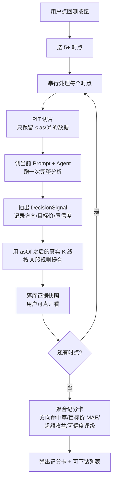

# GOAL v0.5.1 — AI 分析回测（精简评审稿）

Status: Discussion Only · 不进 sprint.md · 评审通过后再拆 Story

## 这事要回答什么

1. AI 对某只股票的判断，过去命中率多少，可信不可信？
2. AI 对某个板块的看法，过去整体表现如何？
3. 改了 Prompt / Agent，能不能在记分卡上看到分数变化？

## 用户怎么用

用户在个股页看 AI 分析，旁边一个"回测可信度"按钮 → 点开顶部 Tab 选时点（默认 6 个：近 1/3/6/12/18/24 个月，至少 5 个）→ 跟现在 AI 分析一样的实时弹窗，能展开任意一步看 MCP / RAG / LLM / 撮合的输入输出 → 跑完弹出记分卡。

## 整体流程



关键三件事：
- **PIT 切片**：让 AI 重新分析时只看到当时已发布的数据，看不到未来
- **串行执行**：18 次 AI 分析（6 时点 × 3 pipeline）必须一个跑完再跑下一个，不并发
- **证据可下钻**：每一步留底，用户点开能看到当时调了什么工具、RAG 召回了什么、数据发布时间是不是 ≤ asOf

## 记分卡长什么样（茅台举例）

```
贵州茅台 (sh600519) — Research pipeline 过去 30 次判断
─────────────────────────────────────────────────
方向命中率：     19/30  = 63%
目标价触达率：   8/30   = 27%
平均回报：       +2.1%（5 日持有）vs 行业 +0.8%
最大回撤命中：   3/4 次正确预警
样本量：         30（充分）
可信度评级：     ★★★☆☆ 偏可信
适用判断：       方向可参考；目标价偏乐观，需打 7 折
```

每一行都可以点开 → 看 30 次具体判断列表 → 再点任意一次 → 看那次的完整证据快照（MCP 调用、RAG 召回片段、所有数据 publishTime ≤ asOf）。

## 评判规则

### 方向命中率
- AI 声明了 `timeHorizonDays` → 用声明窗口末尾收盘价 vs 分析日收盘价判定
- AI 没声明 → fallback T+5（短期）和 T+20（中期）双窗口
- "看多"：窗口末收盘价 > 分析日收盘价 = 命中
- "看空"：窗口末收盘价 < 分析日收盘价 = 命中
- "观察/中性"：窗口内波动 ±2% 以内 = 命中

### 目标价触达率
- 在评判窗口内，盘中最高价（看多）或最低价（看空）是否触达 AI 给出的目标价

### timeHorizonDays 字段
- M2 阶段加入 Commander output schema：`"timeHorizonDays": 5~60`
- 回测时 AI 对冻结数据跑分析即会输出该字段，不需要等新数据积累

## 可冻结数据清单

| 数据维度 | 数据源 | 回填深度 | PIT 切片字段 | 状态 |
|----------|--------|----------|-------------|------|
| 财务报表 | Eastmoney datacenter + cninfo PDF | 25+ 年 | publishTime ≤ asOf | ✅ 已有 3 年，可扩展 |
| K 线（日线） | Eastmoney push2his / Baostock | IPO 至今 | Date ≤ asOf | ⚠️ 本地仅 4 个月，需回填 |
| 公司公告 | cninfo | 12 年 | announcementTime ≤ asOf | ✅ 翻页已修复 (fa38c29) |
| 新闻 | Eastmoney (26 个月翻页) + Sina/CLS (仅实时) | 26 个月 (~20,000 条) | PublishTime ≤ asOf | ✅ Eastmoney page_index 可翻页回填 |
| 板块轮动 | SectorRotationSnapshot | 取决于采集时长 | TradingDate ≤ asOf | ✅ 已有采集服务 |
| 市场情绪 | MarketSentimentSnapshot | 取决于采集时长 | TradingDate ≤ asOf | ✅ 已有采集服务 |
| 资金流向 | Eastmoney 实时推送 | 仅当日 | 无持久化 | ❌ 无法冻结，需外接历史源 |
| RAG 内容 | FinancialWorker chunks | 取决于采集 | 无原始文档发布时间字段 | ❌ 需补 SourcePublishTime（原始 PDF 的发布日期，非入库时间） |

### 已完成的基础设施修复

- ✅ cninfo 公告翻页 (fa38c29)
- ✅ 东方财富市场新闻/公司公告/公告PDF/财报数据翻页 (3a2c236)

### 回测前资源检查 + 按需回填

回填不提前全量跑。每次回测启动时，系统自动检查所选股票+时点范围内的数据是否充足，缺什么补什么。

| 资源 | 检查逻辑 | 不足时的回填动作 |
|------|---------|---------------|
| K 线 | KLinePoints 是否覆盖 asOf 前后各 30 日 | 调 Eastmoney push2his 补缺 |
| 财报 PDF | LiteDB 中是否有 ≤ asOf 的报表 | 调 cninfo + Eastmoney datacenter 补 |
| 公告 | 公告表是否有 ≤ asOf 的记录 | 调 cninfo 翻页补 |
| 新闻 | LocalStockNews 是否有 asOf 附近的新闻 | 调 Eastmoney 新闻 API 翻页补（最多 26 个月） |
| RAG | chunks 是否有 ≤ asOf 的内容 | 触发 FinancialWorker 重新 ingest + chunk |

### MVP 阶段不覆盖的维度

- ⚠️ 资金流向：无历史持久化，MVP 回测不含此维度
- ⚠️ RAG 内容：chunks 表缺少 `SourcePublishTime` 字段（指原始财报/公告 PDF 的发布日期，不是存入 RAG 的时间），需后续补充才能做 PIT 切片

## 分几步做

| 阶段 | 一句话 |
|---|---|
| M0 | 先写一组会失败的防泄漏单测，证明现在的回测会作弊 |
| M1 | 做时点切片层，让所有数据查询都能按 asOf 过滤 |
| M2 | 让 Research / Recommend / LiveGate 每次输出都能抽成结构化信号 |
| M3 | 写 A 股规则撮合（T+1 / 涨跌停 / 停牌 / 复权 / 费率） |
| M4 | 个股 / 板块 / 评级三套记分卡 |
| M4.5 | 手动触发 UI + 实时流式输出 + 证据可点开 |
| M5 | 组合层回测（榜单 vs 沪深300 / 行业指数） |

## 评审时拍板

- 第一批回测哪 3 只股票？
- 时点 Tab 要不要默认 6 个、最少 5 个？
